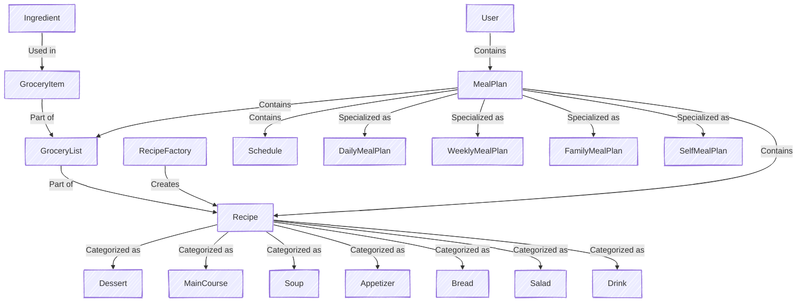
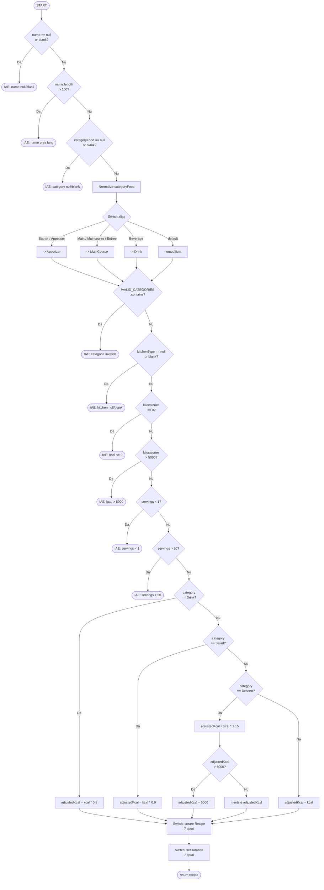
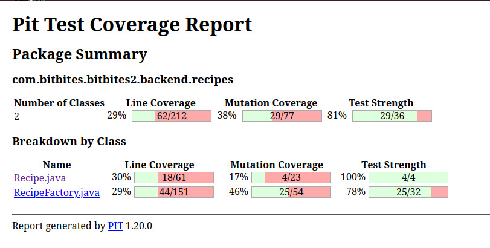

# Tema 3: Testare Unitara în Java - BitBites

**Membri Echipa:**
* Alexandru Norina
* Balan Liviu
* Calinov Cosmin
* Fota Adrian
* Preda Cristian

---

# BitBites

## Prezentare Generala

BitBites este o aplicatie Java pentru planificarea meselor, care genereaza planuri saptamanale de alimentatie si liste de cumparaturi bazate pe retetele selectate. Sistemul este proiectat cu o abordare orientata pe obiecte, folosind mostenire si pattern-ul factory pentru a gestiona eficient planificarea meselor.

## Video si Prezentare
Video de prezentare a aplicatiei: [https://s.go.ro/iv7t6hs7](https://s.go.ro/iv7t6hs7)

Executia testelor: [https://s.go.ro/iv7t6hs7](https://s.go.ro/01vsnz9c)

Prezentare PowerPoint: [Java Unit Testing](presentation/Java%20Unit%20Testing.pptx)

## Functionalitati

- Defineste **ingrediente** si categorizeaza-le.
- Creeaza **retete** cu atribute detaliate (calorii, portii, instructiuni, etc.).
- Genereaza planuri de masa de diferite tipuri (zilnic, saptamanal, familie).
- Creeaza o lista de cumparaturi bazata pe retetele selectate.
- Creeaza o lista de cumparaturi bazata pe un plan de masa generat.
- Foloseste un **pattern de tip factory** pentru a crea retete dintr-un URL.
- **Agregheaza ingrediente** automat si gestioneaza **conversiile de unitati**.
- **Stocheaza planuri de masa** pentru utilizatori.
- Creeaza o **baza de date de utilizatori** cu hash-uirea parolelor stocate.
- Asigura ca planurile de masa indeplinesc **constrangerile calorice**.
- (Bonus) Ofera o **interfata web** pentru gestionarea retetelor, planurilor de masa si listelor de cumparaturi.

---

## Logica Proiectului

Sistemul urmeaza o abordare structurata cu componente interconectate. Logica de baza se concentreaza pe:

- **Ingredients**: Reprezentate prin inregistrari simple, categorizate pentru gestionare mai usoara.
- **Grocery Items**: Definite prin ingredient, cantitate si unitate, permitand agregare si conversie a unitatilor.
- **Recipes**: Reprezentare abstracta a unei mese, categorisita in tipuri precum `Dessert`, `MainCourse`, etc.
- **Recipe Factory**: Initial suporta importul retetelor dintr-un singur site, cu extensibilitate ulterioara pentru mai multe surse.
- **Schedule**: Define structura meselor zilnice, asigurand un plan de masa echilibrat.
- **Meal Plans**:
    - **SelfMealPlan**: Utilizatorul furnizeaza o lista predefinita de retete, iar logica de generare nu este necesara.
    - **Alte planuri de masa (Daily, Weekly, Family)**:
        - Utilizatorul selecteaza tipurile de bucatarie si un interval de timp de preparare.
        - Sistemul alege aleator retete din bucatariile alese, asigurand ca aportul total de calorii este echilibrat.
        - **FamilyMealPlan** extinde planul saptamanal (weekly) prin ajustarea portiilor in functie de numarul de persoane.
        - Sistemul previne mesele duplicate si echilibreaza distributia meselor pe parcursul saptamanii.

### Reprezentare Diagrama

Diagrama urmatoare reprezinta vizual logica de baza a **BitBites**:



---
## Baza de Date

- implementata folosind PostgreSQL
- a fost nevoie sa adaugam cateva clase Model pentru a realiza baza de date
  - colectiile si tablourile din obiecte sunt transformate in chei straine in clasele incluse
  - am adaugat inregistrari pentru a stoca cheile primare (id) si cheile straine
- am adaugat operatii CRUD pe toate tabelele (functii diferite pentru tabele)

### Diagrama

---

## Interfata Web

Aplicatia web BitBites va furniza urmatoarele functionalitati:

- **Creeaza si stocheaza retete**.
- **Genereaza planuri de masa** de orice tip.
- **Vizualizeaza lista de cumparaturi** pentru planurile de masa selectate.
- **Vezi mesele planificate** pentru saptamana intr-un format de calendar.

---

# Documentatie de Testare si Asigurare a Calitatii (QA)

Aceasta sectiune detaliaza ciclul de viata al testarii software pentru aplicatia BitBites, incluzand configurarea mediului, strategiile de testare unitara backend, automatizarea UI frontend, comparatii intre framework-uri si utilizarea instrumentelor AI in faza de testare.

## 1. Configurarea Mediului de Testare

### Specificatii Hardware si Software
* **Sistem de Operare:** Windows 11 (64-bit)
* **Mediu de Executie:** Calculator local (fara masina virtuala)
* **Java Development Kit:** JDK 21.0.6
* **Baza de Date de Test:** PostgreSQL local (Default port 5432)

### Instrumente si Versiuni
* **Framework Backend:** JUnit 5 (Jupiter API)
* **Automatizare Frontend:** Selenium WebDriver (v4.31.0)
* **Driver Browser Web:** Firefox GeckoDriver (v0.36.0) rulat in mod `--headless`
* **Code Coverage Tool:** IntelliJ IDEA Built-in Coverage Runner
* **Build Tool:** Gradle


---
## 2. Prezentare Testarii si Rezumatul Executiei

### 2.1. Matrice de Trasabilitate
Aceasta matrice coreleaza suitele de test implementate cu modulele functionale ale aplicatiei si evidentiaza tehnicile de testare aplicate pentru fiecare componenta.

| Clasa de Test | Componenta Tinta (Productie) | Tehnici de Testare Aplicate | Status |
| :--- | :--- | :--- | :--- |
| **ApplicationTests** | Spring Boot Context | Smoke/Context Load (`@SpringBootTest`) | ✅ Passed |
| **GroceryListTest** | `GroceryList` | EP, BVA, Category Partitioning, Statement Coverage | ✅ Passed |
| **MealPlanFactoryTest** | `MealPlanFactory` | EP, BVA, Statement Coverage, Decision Coverage | ✅ Passed |
| **PasswordUtilsTest** | `PasswordUtils` | EP, BVA, Category Partitioning, Statement Coverage | ✅ Passed |
| **BoundaryValueTest** | `RecipeFactory` | Boundary Value Analysis (BVA) | ✅ Passed |
| **ConditionPathTest** | `RecipeFactory` | MC/DC, Independent Paths Coverage | ✅ Passed |
| **CoverageTest** | `RecipeFactory` | Statement Coverage, Decision Coverage | ✅ Passed |
| **EquivalencePartitioningTest** | `RecipeFactory` | Equivalence Partitioning (EP) | ✅ Passed |
| **MutationTest** | `RecipeFactory` | Mutation Testing (Killer Tests) | ✅ Passed |
| **RecipeTest** | `Recipe` | EP, BVA, Category Partitioning, Statement Coverage | ✅ Passed |
| **UnitConverterTest** | `UnitConverter` | EP, BVA, Category Partitioning, Statement Coverage | ✅ Passed |
| **SeleniumUITests** | Frontend UI (Web Routes) | UI Automation, End-to-End (E2E), Wait Strategies | ✅ Passed |

**Legenda Tehnici:**
* **EP:** Equivalence Partitioning
* **BVA:** Boundary Value Analysis
* **MC/DC:** Modified Condition/Decision Coverage
* **E2E:** End-to-End Testing
### 2.2. Arhitectura Suitei de Teste

Pentru a asigura o testare modulara si usor de intretinut, clasele de test sunt grupate logic pentru a viza componente arhitecturale specifice:

*   **Teste pentru Logica Grocery (`GroceryListTest`, `UnitConverterTest`):** Valideaza agregarea, conversia unitatilor si sortarea (`sortedGroceryList()`), cu comportament de inlocuire in `GroceryList` pentru unitati incompatibile si aruncare stricta `IllegalArgumentException` in `UnitConverter` cand unitatile nu sunt compatibile.
*   **Teste pentru Plan de Masa (`MealPlanFactoryTest`):** Asigura instantierea corecta a planurilor de masa polimorfice (Daily, Weekly, Family, Self) folosind pattern-ul Factory, validand parametrii de intrare cum ar fi numarul de membri.
*   **Teste de Securitate (`PasswordUtilsTest`):** Verifica comportamentul determinist si rezistenta la cazuri limita a utilitarului de hashing SHA-256 pentru parole.
*   **Teste pentru Recipe Factory (Logica de Baza):** O suita cuprinzatoare (`BoundaryValueTest`, `ConditionPathTest`, `CoverageTest`, `EquivalencePartitioningTest`, `MutationTest`) care vizeaza `RecipeFactory`. Valideaza constrangerile de siruri, capacele calorice, modificatorii specifici categoriei (de exemplu, ajustarea kilocaloriilor cu *0.8 pentru Drinks) si maparile alias folosind MC/DC si testare de mutatie.
*   **Teste pentru Reteta (`RecipeTest`):** Valideaza clasa abstracta `Recipe`, in special conversia sirurilor de timp in obiecte `Duration` si formatarea rezultatelor.
*   **Teste E2E UI (`SeleniumUITests`):** Ruleaza teste automatizate headless cu Selenium WebDriver pentru a valida rutarea frontend, prezenta elementelor de formular si gestionarea erorilor de autentificare.
*   **Teste Smoke/Context (`ApplicationTests`):** Valideaza ca contextul Spring Boot se incarca cu succes.

### 2.3. Executia Testelor si Raportul de Acoperire

Suita de teste a fost executata local in mediul de test configurat. Executia a generat urmatoarele metrici concrete:

**Rezumat Executie:**
*   **Total Teste Rulate:** 196
*   **Teste Trecute:** 196
*   **Teste Nerezolvate:** 0
*   **Status Executie:** ✅ SUCCESS

**Analiza Acoperire:**
Metodele de masurare a acoperirii au fost extrase folosind IntelliJ IDEA Built-in Coverage Runner.
*   **Acoperire Logica Domeniu:** Strategia de testare a vizat agresiv regulile de business de baza (`backend.groceries`, `backend.mealplans`, `backend.recipes`, `PasswordUtils`).
*   **Acoperire Claselor Backend:** 50%.
*   **Acoperire Claselor Controller Frontend:** 40%.
*   **Justificare Out of Scope:** Procentele de acoperire a liniilor si a ramurilor reflecta in mod logic excluderea deliberata a Layer-ului de Acces la Date (`Repositories`) si a modulelor de integrare a bazei de date (`Services`) din faza curenta de testare unitara. Aceste componente structurale sunt explicit in afara scope-ului pentru testele izolate si sunt rezervate pentru viitoarele faze de testare de integrare.

### 2.4. Comparatie Modele AI in Generarea Testelor Unitare
Pentru a evalua eficienta inteligentei artificiale in faza de testare, am rulat un experiment comparativ folosind mai multe modele AI si o referinta manuala. Am comparat numarul de teste si calitatea acoperirii (acoperire clasa, metoda, linie si ramura).

| Model AI | Teste Trecute | Teste Nerezolvate | Acoperire Clasa | Acoperire Metoda | Acoperire Linie | Acoperire Ramura |
| :--- | :---: | :---: | :---: | :---: | :---: | :---: |
| **Opus 4.6** | 275 | 0 | 51% | 36% | 16% | 17% |
| **Codex 5.2** | 40 | 0 | 48% | 30% | 12% | 10% |
| **Opus 4.6 (with context)** | 285 | 0 | 50% | 28% | 15% | 19% |
| **Manual** | 196 | 0 | 51% | 31% | 16% | 24% |
| **Gemini 3.5 Pro** | 55 | 0 | 24% | 13% | 8% | 16% |

### Concluzii Analiza:
1. **Stabilitate:** Toate suitele s-au finalizat cu 0 teste esuate, astfel acoperirea este principalul factor de diferentiere in aceasta comparatie.
2. **Impact Context (Opus 4.6):** Adaugarea contextului a crescut numarul de teste (275 la 285) si a imbunatatit acoperirea ramurilor (17% la 19%), dar a redus acoperirea metodelor si a liniilor (36% la 28%, si 16% la 15%).
3. **Primii si Ultimii in Acoperire:** Opus 4.6 conduce la acoperirea claselor, metodelor si liniilor, in timp ce Opus 4.6 cu context si Manual se leaga la acoperirea ramurilor (19%). Codex 5.2 si Gemini 3.5 Pro sunt mai slabe la acoperire, cu Gemini 3.5 Pro afisand cea mai mica acoperire pentru clase si metode.
---
## 3. Testare Black-Box (Bazata pe Specificatie)

Pentru a valida logica de baza a aplicatiei fara a se baza pe structura interna, am aplicat tehnici Black-Box in toate componentele majore. Clasele de test sunt grupate dupa tehnica specifica aplicata:

### 3.1. Equivalence Class Partitioning (EP)
Datele de intrare au fost clasificate in partitii valide si invalide pentru a asigura acoperire completa a scenariilor, minimizand cazurile redundante.

*   **`GroceryListTest`:** A partitionat datele pentru a valida adaugarea de ingrediente noi, fuziunea ingredientelor existente cu unitati compatibile si inlocuirea ingredientelor existente cu unitati incompatibile.
*   **`MealPlanFactoryTest`:** A partitionat sirurile de intrare pentru generarea unor planuri de masa specifice (`"daily"`, `"family"`, `"self"`, `"weekly"`) si a gestionat tipurile invalide necunoscute.
*   **`PasswordUtilsTest`:** A grupat intrarile in parole goale, parole alfanumerice standard si caractere speciale/Unicode pentru a asigura hashing SHA-256 determinist.
*   **`EquivalencePartitioningTest` (`RecipeFactory`):** A validat lungimile sirurilor pentru numele retetelor, tipurile de bucatarie permise si a impus domeniile numerice pentru kilocalorii (0, 5000] si portii [1, 50].
*   **`RecipeTest`:** A partitionat intrarile de unitati de timp in siruri valide (`"h"`, `"minutes"`, `"s"`) si siruri invalide (`"days"`).
*   **`UnitConverterTest`:** A grupat conversiile in identitate (aceeasi unitate), intra-categorie (de exemplu, masa-la-masa), compatibilitate inter-categorie si incompatibilitate stricta.

### 3.2. Boundary Value Analysis (BVA)
Testele au fost implementate la marginile absolute ale partitiilor de echivalenta definite pentru a preveni erorile "off-by-one" si pentru a gestiona valori extreme.

*   **`GroceryListTest`:** A testat tranzitia de la lista goala la lista cu primul element si a gestionat cantitatile exacte rezultate din conversii fractionare.
*   **`MealPlanFactoryTest`:** A validat limita inferioara pentru numarul de membri intr-un `FamilyMealPlan` (minim 1) si a testat intrarile cu siruri goale.
*   **`PasswordUtilsTest`:** A validat stabilitatea hashingului la limite extreme: lungimea minima nenula (1 caracter) si intrari masive (1000 de caractere).
*   **`BoundaryValueTest` (`RecipeFactory`):** A testat limitele absolute ale lungimii sirului (0, 1, 100, 101 caractere), pragurile numerice pentru calorii (`0.001`, `5000.0`, `5000.001`) si limitele portiilor (0, 1, 50, 51).
*   **`RecipeTest`:** A testat asignarile de durata cu cantitati la limita (`0`).
*   **`UnitConverterTest`:** A validat limitele de precizie folosind fractii foarte mici (`0.000001`) si praguri mari (`1,000,000`) pentru a verifica acuratetea cu virgula mobila si integer overflow.


### 3.3. Category Partitioning
A fost folosita pentru a evalua functionalitatile care depind de mai multi parametri independenti ce interactioneaza impreuna.
* Aplicata in **`GroceryListTest`** (combinand liste goale/negoale cu ingrediente comune/distincte) si **`UnitConverterTest`** (combinand volum-la-bucatarie si bucatarie-la-masa in interactiuni parametrii).


---

## 4. Testare White-Box (Bazata pe Structura)

Testarea White-Box a fost efectuata pentru a analiza arhitectura interna, asigurand executia cuprinzatoare a tuturor cailor de cod, ramurilor si deciziilor logice.

### 4.1. Acoperire Statement si Decision
Am utilizat IntelliJ IDEA Coverage Runner pentru a garanta ca fiecare linie de cod si fiecare ramura booleana a fost executata.

*   **`CoverageTest` (`RecipeFactory`):** A impus executia tuturor celor 16 instructiuni (SC1-SC16), inclusiv ramurile de tratare a erorilor si ajustarile calorice. A evaluat 14 decizii logice (DC1-DC14) atat ca adevarate, cat si ca false.
*   **`GroceryListTest`:** A acoperit toate ramurile din metodele `addItem` si `addLists`, parcurgand logica conditionala pentru fuziunea elementelor si capturarea exceptiilor.
*   **`MealPlanFactoryTest`:** A asigurat ca toate cazurile `switch` si fallback-ul `default` au fost executate si evaluate.
*   **`PasswordUtilsTest`:** A executat calea `try` pentru hashing SHA-256; ramura `catch` este documentata dar nu este de asteptat sa se declanseze pe un JVM standard.
*   **`RecipeTest` & `UnitConverterTest`:** Au obtinut acoperire pe instructiunile `switch` complexe imbricate, validand atat cazurile potrivite cat si aruncarile default.

### 4.2. Modified Condition/Decision Coverage (MC/DC)
A fost aplicata structurilor de decizie complexe cu operatori logici pentru a asigura ca conditiile atomice influenteaza independent rezultatul.
*   **`ConditionPathTest` (`RecipeFactory`):** A validat conditiile compuse precum `name == null || name.trim().isEmpty()` prin testarea evaluarii short-circuit (C1a), evaluarii complete a sirului (C1b) si a ramurii valide false (C1c).


#### Flowchart - RecipeFactory (Cai independente)
Diagrama urmatoare ilustreaza punctele de decizie din metoda de creare a retetelor, conturand caile independente:
Pentru a asigura robustete structurala, eforturile noastre de testare s-au concentrat puternic pe `RecipeFactory` datorita rolului sau critic in validarea datelor, maparea alias-urilor si logica specifica categoriei. Diagrama urmatoare ilustreaza vizual punctele de decizie complexe din metoda de creare a retetelor, conturand caile independente pe care suita noastra de test le acopera:

### 4.3. Complexitate Ciclomatica si Cai Independente
Complexitatea ciclomatica ($V(G) = E - N + 2$) a fost calculata pentru metodele critice pentru a determina matematic numarul necesar de cai independente de testare.

**Metoda folosita (McCabe):** $V(G) = 1 + D$, unde $D$ este numarul de puncte de decizie. Am numarat `if`/`else if`, bucle, `catch`, fiecare `case` plus `default` intr-un `switch`, si ternarul `?:`. Nu am adaugat puncte in plus pentru `&&` sau `||` dintr-o conditie.


*   **`UnitConverter.convert()`:** $V(G) = 33$. Testele parcurg cai independente in cadrul structurilor `switch` imbricate.
*   **`GroceryListTest` (`addItem`):** $V(G) = 3$. Cai independente mapate la: element absent din lista, element existent + conversie reusita, element existent + conversie esuata.
*   **`MealPlanFactoryTest` (`createMealPlan`):** $V(G) = 6$. Acoperit cai pentru toate cele 4 tipuri de plan, fallback invalid si verificarea intrarii nule.
*   **`PasswordUtils.hashPassword()`**: $V(G) = 3$ (o bucla + un catch).
*   **`Recipe.setDuration()`**: $V(G) = 5$ (trei etichete `case` plus `default`).
*   **`ConditionPathTest` (`RecipeFactory.createCustomRecipe()`):** A identificat $V(G) = 31$ puncte de decizie, rezultand 23 de teste independente implementate (IP1-IP23), parcurgand toate stările de eroare, maparile alias si modificatorii calorici.


---

## 5. Testare de Mutatie

Pentru a evalua capacitatea de detectare a defectelor, am folosit doua abordari complementare: mutanti realizati manual in `MutationTest` (detaliati in [Sectiunea 6.6](#66-mutationtest---fault-detection-capability-verification)) si un raport PIT automat pentru pachetul `backend.recipes`.

### 5.1 Raport PIT Mutation Testing

**Domeniu:** `com.bitbites.bitbites2.backend.recipes`

| Domeniu | Clase | Acoperire Linii | Acoperire Mutatie | Forta Test | 
| :--- | :---: | :---: | :---: | :---: |
| Rezumat Pachet | 2 | 29% (62/212) | 38% (29/77) | 81% (29/36) |

**Defalcare pe Clase:**

| Clasa | Acoperire Linii | Acoperire Mutatie | Forta Test |
| :--- | :---: | :---: | :---: |
| `Recipe.java` | 30% (18/61) | 17% (4/23) | 100% (4/4) |
| `RecipeFactory.java` | 29% (44/151) | 46% (25/54) | 78% (25/32) |

Aceste rezultate PIT evidentiaza lacunele ramase in mutatiile din pachetul recipes si completeaza mutantii tintiti, realizati manual, din `MutationTest`.


---

## 6. Testele Recipe Factory - Analiza Detaliata

Metoda `RecipeFactory.createCustomRecipe()` este componenta critica a logicii de validare si creare a retetelor in aplicatie. Datorita complexitatii sale ($V(G) = 31$), constrangerilor multiple de parametri si regulilor de business specifice fiecarei categorii, este testata folosind **cinci clase de test complementare**, fiecare vizand o dimensiune diferita a comportamentului metodei. Aceasta abordare in straturi asigura detectarea cuprinzatoare a defectelor.

### 6.1. De ce cinci clase de test pentru o singura metoda?

Cele cinci clase de test `RecipeFactory` abordeaza obiective diferite de testare care nu sunt **redundante**, ci **complementare**:

| Clasa de Test | Obiectiv Principal | Tehnici Aplicate | Defecte Cheie Gasite |
|:---|:---|:---|:---|
| **EquivalencePartitioningTest** | Partitionarea domeniului de intrare | EP (18 partitii) | Intrari invalide, incalcari de constrangere |
| **BoundaryValueTest** | Detectarea cazurilor limita | BVA (14 limite) | Erori off-by-one, probleme de precizie float |
| **ConditionPathTest** | Acoperire logica decizii | MC/DC (23 cai) | Erori logice in conditiile compuse |
| **CoverageTest** | Executie a tuturor cailor de cod | Statement + Decision Coverage (16 cai) | Cod inaccesibil/dead code, ramuri sarite |
| **MutationTest** | Verificarea calitatii testelor | Mutation Killing (12 mutanti) | Asertiuni insuficiente, logica test slaba |

**Scenariu exemplu:** O valoare la limita de `kilocalories = 5000.0` poate trece testarea EP (partitie valida), dar doar BVA detecteaza ca `5000.001` trebuie sa esueze. Testarea de mutatie confirma apoi ca conditia este strict `>` (nu `>=`).

---

### 6.2. EquivalencePartitioningTest - Maparea completa a partitiilor

**Obiectiv:** Valideaza ca toate clasele distincte de intrare sunt tratate corect, minimizand testele redundante si asigurand acoperire completa.

**Structura Partitiilor (18 partitii de echivalenta):**

```
parametrul name (5 partitii):
  ├─ EP1:  null                              → IllegalArgumentException
  ├─ EP2:  "" sau "   " (blank/spatiu alb) → IllegalArgumentException
  ├─ EP3:  "A" pana la "ValidName" (1-100 caractere) → Reteta valida creata
  └─ EP4:  "A"*101 (> 100 caractere)         → IllegalArgumentException

parametrul categoryFood (5 partitii):
  ├─ EP5:  null                              → IllegalArgumentException
  ├─ EP6:  "" sau "   " (blank)           → IllegalArgumentException
  ├─ EP7:  Categoria valida ("Soup", "Dessert", etc.)
                                              → Reteta valida creata
  ├─ EP8:  Alias valid ("Starter" → "Appetizer", "Entree" → "MainCourse")
                                              → Reteta valida creata
  └─ EP9:  Categoria invalida ("Pizza", "Pasta")
                                              → IllegalArgumentException

parametrul kitchenType (3 partitii):
  ├─ EP10: null                              → IllegalArgumentException
  ├─ EP11: "" sau "   " (blank)           → IllegalArgumentException
  └─ EP12: Tip de bucatarie valid ("Italian", "Asian", etc.)
                                              → Reteta valida creata

parametrul kilocalories (3 partitii):
  ├─ EP13: ≤ 0 (zero sau negativ)            → IllegalArgumentException
  ├─ EP14: (0, 5000] (interval valid)        → Reteta valida creata
  └─ EP15: > 5000                            → IllegalArgumentException

parametrul servings (3 partitii):
  ├─ EP16: < 1 (zero sau negativ)            → IllegalArgumentException
  ├─ EP17: [1, 50] (interval valid)          → Reteta valida creata
  └─ EP18: > 50                              → IllegalArgumentException
```

**Maparea Cazurilor de Test:**
- `ep1_nameNull_throwsException()` → EP1
- `ep2_nameBlank_throwsException()` → EP2
- `ep3_nameValid_recipeCreated()` → EP3
- `ep4_nameTooLong_throwsException()` → EP4
- (... si alte 14 metode de test acoperind EP5-EP18)

**Relevanta in lumea reala:** Un nume de reteta care depaseste 100 de caractere ar suprascrie campurile de afisare UI sau limitele coloanei din baza de date. Categoriile goale impiedica logica corecta de generare a planurilor de masa. Caloriile in afara intervalului pot strica algoritmii de echilibrare calorica.

---

### 6.3. BoundaryValueTest - Testare precisa a cazurilor limita

**Obiectiv:** Testeaza pragurile exacte unde comportamentul se schimba. Boundary Value Analysis detecteaza erorile off-by-one si problemele de precizie float invizibile pentru partitionarea de echivalenta.

**Valori limita (14 cazuri de test):**

```
lungimea numelui (domeniu [1, 100]):
  BV1:  lungime = 0        → ar trebui sa arunce (boundary -1)
  BV2:  lungime = 1        → ar trebui sa treaca (boundary +1)
  BV3:  lungime = 100      → ar trebui sa treaca (boundary)
  BV4:  lungime = 101      → ar trebui sa arunce (boundary +1)

kilocalorii (domeniu (0, 5000]):
  BV5:  0.0               → ar trebui sa arunce (boundary)
  BV6:  0.001             → ar trebui sa treaca (abia in interiorul boundary-ului)
  BV7:  5000.0            → ar trebui sa treaca (boundary)
  BV8:  5000.001          → ar trebui sa arunce (abia in afara boundary-ului)

portii (domeniu [1, 50]):
  BV9:  0                 → ar trebui sa arunce (abia in afara boundary-ului)
  BV10: 1                 → ar trebui sa treaca (boundary)
  BV11: 50                → ar trebui sa treaca (boundary)
  BV12: 51                → ar trebui sa arunce (abia in afara boundary-ului)

Caz special categoria Dessert (cap intern la kcal * 1.15 > 5000):
  BV13: kilocalorii = 4347  → adjustedKcal = 4999.05 (< 5000) → nu se aplica cap
  BV14: kilocalorii = 4348  → adjustedKcal = 5000.2 (> 5000)  → cap la 5000
```

**De ce conteaza:**
- **BV1 vs BV2:** Asigura ca numele cu lungime 0 sunt respinse in timp ce cele cu lungime 1 sunt acceptate, si confirma ca limita maxima permite 100 de caractere dar respinge 101 (conditia trebuie sa fie `> 100`, nu `>= 100`).
- **BV5 vs BV6:** Prinde mutatii precum `kilocalories <= 0` (permite 0) vs `kilocalories < 0` (nu permite 0).
- **BV13 vs BV14:** Valideaza ca logica capului Dessert este aplicata doar cand se depaseste strict, nu la egalitate.

**Precizie cu virgula mobila:** BV6 (`0.001`) testeaza ca verificarea este `<= 0` (nu `< 0`), prindand cazurile in care kilocaloriile sunt extrem de mici dar valide. Aceasta previne erorile de rotunjire in calculele formulelor.

---

### 6.4. ConditionPathTest - Modified Condition/Decision Coverage (MC/DC)

**Obiectiv:** Asigura ca fiecare conditie dintr-o decizie compusa influenteaza independent rezultatul. Aceasta prinde erori logice ca paranteze lipsa sau operatori `&&`/`||` incorecti.

**Analiza MC/DC (Conditii Compuse):**

```
Conditia Compusa C1: (name == null) || (name.trim().isEmpty())
  
  Sub-cai MC/DC:
    C1a: name == null → adevarat
         Rezultat decizie: adevarat (short-circuit, a doua conditie nu este evaluata)
         Test: mcdcC1a_nameNull_conditionTrue()
  
    C1b: name != null SI name.trim().isEmpty() → adevarat  
         Rezultat decizie: adevarat (prima conditie falsa, a doua adevarata)
         Test: mcdcC1b_nameBlank_secondConditionTrue()
  
    C1c: name != null SI name.trim().isEmpty() → fals
         Rezultat decizie: fals (ambele conditii false)
         Test: mcdcC1c_nameValid_conditionFalse()

Conditia Compusa C2: (categoryFood == null) || (categoryFood.trim().isEmpty())
  Analiza similara in 3 cai pentru validare

Conditia Compusa C3: (kitchenType == null) || (kitchenType.trim().isEmpty())
  Analiza similara in 3 cai pentru validare
```

**De ce conteaza - Exemplu mutatie real:**
```java
// Cod original (CORECT):
if (name == null || name.trim().isEmpty()) {
    throw new IllegalArgumentException("Name cannot be null or empty");
}

// Mutatie incorecta (PRINSA de MC/DC):
if (name == null && name.trim().isEmpty()) {  // s-a schimbat || in &&
    throw new IllegalArgumentException("Name cannot be null or empty");
}
// Cu aceasta mutatie: name="" trece validarea (BUG!)
// Testul MC/DC mcdcC1b detecteaza asta: name="   " ar trebui sa arunce, dar nu o face.
```

**Total Cai Independente:** 23 cai (IP1-IP23) parcurg toate stările de validare, maparile alias si ajustarile calorice specifice categoriei.

---

### 6.5. CoverageTest - Acoperire Statement si Decision

**Obiectiv:** Executa fiecare linie de cod si fiecare decizie de ramura, asigurand ca nu exista cai de cod neexplorate.

**Structura Acoperire (16 Cai Statement + 14 Puncte Decision):**

```
SC1-SC9:   Verificarile de validare a intrarilor (toate cele 9 conditii IAE)
SC10-SC12: Maparea alias-urilor categoriei (Starter→Appetizer, Entree→MainCourse, Beverage→Drink)
SC13-SC15: Ajustarea kilocaloriilor in functie de categorie:
           - SC13: categorie Drink   → adjustedKcal = kcal * 0.8
           - SC14: categorie Salad   → adjustedKcal = kcal * 0.9
           - SC15: categorie Dessert → adjustedKcal = kcal * 1.15
SC16:      Aplicarea capului Dessert (daca adjustedKcal > 5000 → cap la 5000)

Decision Coverage (DC1-DC14):
  DC1-DC9:   Toate conditiile de validare evaluate atat adevarat cat si fals
  DC10-DC12: Toate cazurile alias acoperite (daca Starter, daca Entree, daca Beverage, default)
  DC13:      Decizia capului Dessert (daca adjustedKcal > 5000, altfel nu)
  DC14:      Selectia tipului de reteta (7 subtipuri de reteta bazate pe categorie)
```

**Exemple de Test:**
```java
// SC1: Validarea numelui - calea pozitiva (trece validarea)
Recipe r1 = RecipeFactory.createCustomRecipe("Pasta", "MainCourse", "Italian", 500, 4);

// SC10 + DC10: Maparea alias-ului - "Starter" → "Appetizer"
Recipe r2 = RecipeFactory.createCustomRecipe("Bruschetta", "Starter", "Italian", 150, 6);

// SC15 + DC13: Dessert cu cap
Recipe r3 = RecipeFactory.createCustomRecipe("Cake", "Dessert", "French", 4348, 8);
// Asteptat: adjustedKcal = 5000 (capat din 4348 * 1.15 = 5000.2)
```

---

### 6.6. MutationTest - Verificarea capacitatii de detectare a defectelor

**Obiectiv:** Injecteaza defecte artificiale (mutanti) in cod si verifica daca testele le prind. Aceasta valideaza calitatea suitei de teste.

**12 Teste Killer (M1-M12):**

```
MUTATII CONDIITIE MARGINAS:

M1: kilocalories <= 0  →  kilocalories < 0
    Efect mutatie: kilocalories = 0.0 ar trece (BUG)
    Test killer: mt1_killMutant_kcalZeroMustThrow()
    Asertiune: assertThrows(IllegalArgumentException.class, 
                           () → createCustomRecipe(..., 0.0, ...))

M2: kilocalories > 5000  →  kilocalories >= 5000
    Efect mutatie: kilocalories = 5000 ar arunca eroare (BUG)
    Test killer: mt2_killMutant_kcal5000MustBeValid()
    Asertiune: assertEquals(5000.0, recipe.getKilocalories())

M3: servings < 1  →  servings <= 1
    Efect mutatie: servings = 1 ar arunca eroare (BUG)
    Test killer: mt3_killMutant_servings1MustBeValid()

M4: servings > 50  →  servings >= 50
    Efect mutatie: servings = 50 ar arunca eroare (BUG)
    Test killer: mt4_killMutant_servings50MustBeValid()

M5: name.length() > 100  →  name.length() >= 100
    Efect mutatie: un nume de 100 de caractere ar arunca eroare (BUG)
    Test killer: mt5_killMutant_name100CharsMustBeValid()

────────────────────────────────────────────────────────────────

MUTANTI ARITMETICI (Multiplicatori de categorie):

M6: kilocalories * 0.8  →  kilocalories * 0.9  (categorie Drink)
    Efect mutatie: kilocaloriile pentru Drink ar fi calculate gresit
    Test killer: mt6_killMutant_drinkKcalMultiplierIs08()
    Date test: kcal = 1000, categorie = "Drink"
    Asteptat: recipe.getKilocalories() == 800 (nu 900)
    Asertiune detecteaza: assertNotEquals(900, actual)

M7: kilocalories * 0.9  →  kilocalories * 0.8  (categorie Salad)
    Test killer: mt7_killMutant_saladKcalMultiplierIs09()
    Date test: kcal = 1000, categorie = "Salad"
    Asteptat: recipe.getKilocalories() == 900 (nu 800)

M8: kilocalories * 1.15  →  kilocalories * 1.0  (categorie Dessert)
    Test killer: mt8_killMutant_dessertKcalMultiplierIs115()
    Date test: kcal = 1000, categorie = "Dessert"
    Asteptat: recipe.getKilocalories() == 1150 (nu 1000)

────────────────────────────────────────────────────────────────

MUTATII LOGICE:

M9: adjustedKcal > 5000  →  adjustedKcal >= 5000  (cap Dessert)
    Efect mutatie: capul se aplica cand kcal*1.15 == exact 5000 (eroare off-by-one)
    Test killer: mt9_killMutant_dessertCapBoundaryIsStrictlyGreater()
    Date test: kcal = 4347 (adjustedKcal = 4999.05, NU trebuie capat)
    Asteptat: recipe.getKilocalories() == 4999.05 (nu 5000)

M10: Aliasul "Starter" → "Appetizer" eliminat
    Efect mutatie: intrarea "Starter" ar arunca exceptie in loc sa se map-eze
    Test killer: mt10_killMutant_starterAliasMapping()
    Test: recipe = createCustomRecipe("Bruschetta", "Starter", ...)
    Asteptat: categoria retetei este "Appetizer", fara exceptie

────────────────────────────────────────────────────────────────

MUTATII STERGERE STATEMENT:

M11: apelul name.trim() sters
    Efect mutatie: "  Pasta  " ar fi stocat ca "  Pasta  " (cu spatii)
    Test killer: mt11_killMutant_nameTrimIsApplied()
    Date test: name = "  Pasta  "
    Asteptat: recipe.getName() == "Pasta" (spatiile sunt eliminate)
    Asertiune: assertEquals("Pasta", recipe.getName())

M12: Aliasul "Entree" → "MainCourse" eliminat
    Test killer: mt12_killMutant_entreeAliasMapping()
```

**Insight de testare de mutatie:**
Totii cei 12 mutanti non-echivalenti au fost ucisi cu succes, demonstrand ca suita de teste:
- ✅ Detecteaza incalcarile limitelor
- ✅ Valideaza precizia aritmetica
- ✅ Prinde erorile logice
- ✅ Verifica transformarile de date (trim, maparea alias-urilor)

Daca vreun test killer ar fi esuat, ar indica o asertiune slaba sau un caz limita lipsa.

---

### 6.7. Complementaritatea Metodologiei de Testare

**De ce toate cele cinci teste impreuna asigura robustete:**

```
Intrare: kilocalories = 5000.0, categorie = "Dessert"

Nivel Test 1 - EquivalencePartitioningTest:
  └─ Intreaba: "Este 5000 in partitia valida (0, 5000]?"
     Raspuns: DA (5000 este la limita dar inca valid)
     ✓ Treci EP14 (partitie valida)

Nivel Test 2 - BoundaryValueTest:
  └─ Intreaba: "Este 5000 exact la limita sau peste ea?"
     Raspuns: DA (BV7 - exact la limita, ar trebui sa treaca)
     ✓ Treci BV7_kilocalories5000_recipeCreated()

Nivel Test 3 - CoverageTest:
  └─ Intreaba: "Se executa toate ramurile de cod pentru aceasta intrare?"
     Raspuns: DA (executa SC15 pentru Dessert, SC16 pentru verificarea capului)
     ✓ Treci statement-urile SC15, SC16

Nivel Test 4 - ConditionPathTest:
  └─ Intreaba: "Evalueaza corect conditiile compuse?"
     Raspuns: DA (toate conditiile de validare false, categoria potrivita)
     ✓ Treci IP14 (calea de succes Dessert)

Nivel Test 5 - MutationTest:
  └─ Intreaba: "Ar putea asertiunile slabe sa rateze defecte?"
     Raspuns: NU (M9 mutatia ar esua pentru ca verificam:
             assertEquals(5000.0, actual, DELTA))
     ✓ Ucide mutantul M9 (prinde `>= 5000` in loc de `> 5000`)

Rezultat Final: kilocalories = 5000.0 este VERIFICAT TEMEINIC
```

---

### 6.8. Ordinea Recomandata de Executie a Testelor

1. **EquivalencePartitioningTest** (acoperire de baza)
2. **BoundaryValueTest** (prinde cazurile limita)
3. **CoverageTest** (verifica ca toate caile se executa)
4. **ConditionPathTest** (valideaza deciziile logice)
5. **MutationTest** (verifica calitatea testelor)

**Rezultate asteptate:** Toate cele 196 de teste trec ✅

---

## 7. Testare Automata UI (Frontend)

Testarea End-to-End (E2E) a interfetei grafice a fost efectuata folosind **Selenium WebDriver** (`SeleniumUITests.java`). Pentru optimizarea executiei si reducerea instabilitatii cauzate de latenta retelei, testele au fost rulate folosind browserul Firefox in mod `--headless` cu `PageLoadStrategy.NONE`.

**Scenarii validate (10 teste automate UI):**
1.  **Verificare incarcare pagina:** A confirmat ca DOM-ul reda corect headerele `<h2>` si `<h3>` pentru rutele `/user/login`, `/user/register` si `/recipe/`.
2.  **Prezenta elementelor de formular:** A asigurat ca formularele de autentificare contin atributele HTML `required` corecte si ca campurile de parola sunt protejate (`type="password"`).
3.  **Rulare si navigare:** A validat linkurile interne prin simularea de click-uri pe Navbar (Brand Logo, Login, Register) pentru a asigura redirectionarea corecta catre endpoint-uri fara linkuri moarte.
4.  **Gestionarea erorilor:** A simulat incercari de autentificare cu credentile invalide pentru a verifica randarea dinamica a componentei UI `.alert-danger`.

---

### 8. Referinte si Bibliografie
1. R. S. Pressman, Software Engineering: A Practitioner's Approach (8th ed.), McGraw-Hill Education, 2014.
2. JUnit Team, JUnit 5 User Guide, https://junit.org/junit5/docs/current/user-guide/, consultat la 3 mai 2026.
3. Selenium Team, Selenium WebDriver Documentation, https://www.selenium.dev/documentation/webdriver/, consultat la 3 mai 2026.
4. GitHub Copilot, https://copilot.microsoft.com, Generat: 3 mai 2026.
5. Google Gemini, https://gemini.google.com/app, Generat: 3 mai 2026.
---

## Licenta

MIT License.
