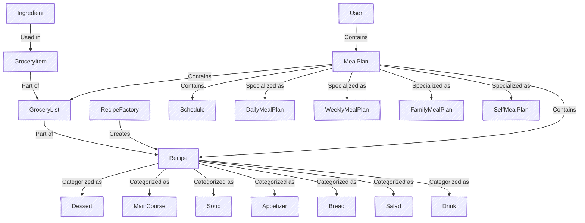

# Tema 3: Testare Unitara în Java - BitBites

**Membri Echipa:**
* Alexandru Norina
* Balan Liviu
* Calinov Cosmin
* Fota Adrian
* Preda Cristian

---

# BitBites

## Prezentare Generala

BitBites este o aplicatie Java pentru planificarea meselor, care genereaza planuri saptamanale de alimentatie si liste de cumparaturi bazate pe retetele selectate. Sistemul este proiectat cu o abordare orientata pe obiecte, folosind mostenire si pattern-ul factory pentru a gestiona eficient planificarea meselor.

## Video si Prezentare
Video de prezentare a aplicatiei: [https://s.go.ro/iv7t6hs7](https://s.go.ro/iv7t6hs7)

Executia testelor: [https://s.go.ro/iv7t6hs7](https://s.go.ro/01vsnz9c)

Prezentare PowerPoint: [Java Unit Testing](presentation/Java%20Unit%20Testing.pptx)

## Functionalitati

- Defineste **ingrediente** si categorizeaza-le.
- Creeaza **retete** cu atribute detaliate (calorii, portii, instructiuni, etc.).
- Genereaza planuri de masa de diferite tipuri (zilnic, saptamanal, familie).
- Creeaza o lista de cumparaturi bazata pe retetele selectate.
- Creeaza o lista de cumparaturi bazata pe un plan de masa generat.
- Foloseste un **pattern de tip factory** pentru a crea retete dintr-un URL.
- **Agregheaza ingrediente** automat si gestioneaza **conversiile de unitati**.
- **Stocheaza planuri de masa** pentru utilizatori.
- Creeaza o **baza de date de utilizatori** cu hash-uirea parolelor stocate.
- Asigura ca planurile de masa indeplinesc **constrangerile calorice**.
- (Bonus) Ofera o **interfata web** pentru gestionarea retetelor, planurilor de masa si listelor de cumparaturi.

---

## Logica Proiectului

Sistemul urmeaza o abordare structurata cu componente interconectate. Logica de baza se concentreaza pe:

- **Ingredients**: Reprezentate prin inregistrari simple, categorizate pentru gestionare mai usoara.
- **Grocery Items**: Definite prin ingredient, cantitate si unitate, permitand agregare si conversie a unitatilor.
- **Recipes**: Reprezentare abstracta a unei mese, categorisita in tipuri precum `Dessert`, `MainCourse`, etc.
- **Recipe Factory**: Initial suporta importul retetelor dintr-un singur site, cu extensibilitate ulterioara pentru mai multe surse.
- **Schedule**: Define structura meselor zilnice, asigurand un plan de masa echilibrat.
- **Meal Plans**:
    - **SelfMealPlan**: Utilizatorul furnizeaza o lista predefinita de retete, iar logica de generare nu este necesara.
    - **Alte planuri de masa (Daily, Weekly, Family)**:
        - Utilizatorul selecteaza tipurile de bucatarie si un interval de timp de preparare.
        - Sistemul alege aleator retete din bucatariile alese, asigurand ca aportul total de calorii este echilibrat.
        - **FamilyMealPlan** extinde planul saptamanal (weekly) prin ajustarea portiilor in functie de numarul de persoane.
        - Sistemul previne mesele duplicate si echilibreaza distributia meselor pe parcursul saptamanii.

### Reprezentare Diagrama

Diagrama urmatoare reprezinta vizual logica de baza a **BitBites**:

---
## Baza de Date

- implementata folosind PostgreSQL
- a fost nevoie sa adaugam cateva clase Model pentru a realiza baza de date
  - colectiile si tablourile din obiecte sunt transformate in chei straine in clasele incluse
  - am adaugat inregistrari pentru a stoca cheile primare (id) si cheile straine
- am adaugat operatii CRUD pe toate tabelele (functii diferite pentru tabele)

### Diagrama

---

## Interfata Web

Aplicatia web BitBites va furniza urmatoarele functionalitati:

- **Creeaza si stocheaza retete**.
- **Genereaza planuri de masa** de orice tip.
- **Vizualizeaza lista de cumparaturi** pentru planurile de masa selectate.
- **Vezi mesele planificate** pentru saptamana intr-un format de calendar.

---

# Documentatie de Testare si Asigurare a Calitatii (QA)

Aceasta sectiune detaliaza ciclul de viata al testarii software pentru aplicatia BitBites, incluzand configurarea mediului, strategiile de testare unitara backend, automatizarea UI frontend, comparatii intre framework-uri si utilizarea instrumentelor AI in faza de testare.

## 1. Configurarea Mediului de Testare

### Specificatii Hardware si Software
* **Sistem de Operare:** Windows 11 (64-bit)
* **Mediu de Executie:** Calculator local (fara masina virtuala)
* **Java Development Kit:** JDK 21.0.6
* **Baza de Date de Test:** PostgreSQL local (Default port 5432)

### Instrumente si Versiuni
* **Framework Backend:** JUnit 5 (Jupiter API)
* **Automatizare Frontend:** Selenium WebDriver (v4.31.0)
* **Driver Browser Web:** Firefox GeckoDriver (v0.36.0) rulat in mod `--headless`
* **Code Coverage Tool:** IntelliJ IDEA Built-in Coverage Runner
* **Build Tool:** Gradle

---
## 2. Prezentare Testarii si Rezumatul Executiei

### 2.1. Matrice de Trasabilitate
Aceasta matrice coreleaza suitele de test implementate cu modulele functionale ale aplicatiei si evidentiaza tehnicile de testare aplicate pentru fiecare componenta.

| Clasa de Test | Componenta Tinta (Productie) | Tehnici de Testare Aplicate | Status |
| :--- | :--- | :--- | :--- |
| **ApplicationTests** | Spring Boot Context | Smoke/Context Load (`@SpringBootTest`) | ✅ Passed |
| **GroceryListTest** | `GroceryList` | EP, BVA, Category Partitioning, Statement Coverage | ✅ Passed |
| **MealPlanFactoryTest** | `MealPlanFactory` | EP, BVA, Statement Coverage, Decision Coverage | ✅ Passed |
| **PasswordUtilsTest** | `PasswordUtils` | EP, BVA, Category Partitioning, Statement Coverage | ✅ Passed |
| **BoundaryValueTest** | `RecipeFactory` | Boundary Value Analysis (BVA) | ✅ Passed |
| **ConditionPathTest** | `RecipeFactory` | MC/DC, Independent Paths Coverage | ✅ Passed |
| **CoverageTest** | `RecipeFactory` | Statement Coverage, Decision Coverage | ✅ Passed |
| **EquivalencePartitioningTest** | `RecipeFactory` | Equivalence Partitioning (EP) | ✅ Passed |
| **MutationTest** | `RecipeFactory` | Mutation Testing (Killer Tests) | ✅ Passed |
| **RecipeTest** | `Recipe` | EP, BVA, Category Partitioning, Statement Coverage | ✅ Passed |
| **UnitConverterTest** | `UnitConverter` | EP, BVA, Category Partitioning, Statement Coverage | ✅ Passed |
| **SeleniumUITests** | Frontend UI (Web Routes) | UI Automation, End-to-End (E2E), Wait Strategies | ✅ Passed |

**Legenda Tehnici:**
* **EP:** Equivalence Partitioning
* **BVA:** Boundary Value Analysis
* **MC/DC:** Modified Condition/Decision Coverage
* **E2E:** End-to-End Testing
### 2.2. Arhitectura Suitei de Teste

Pentru a asigura o testare modulara si usor de intretinut, clasele de test sunt grupate logic pentru a viza componente arhitecturale specifice:

*   **Teste pentru Logica Grocery (`GroceryListTest`, `UnitConverterTest`):** Valideaza agregarea, conversia unitatilor si sortarea (`sortedGroceryList()`), cu comportament de inlocuire in `GroceryList` pentru unitati incompatibile si aruncare stricta `IllegalArgumentException` in `UnitConverter` cand unitatile nu sunt compatibile.
*   **Teste pentru Plan de Masa (`MealPlanFactoryTest`):** Asigura instantierea corecta a planurilor de masa polimorfice (Daily, Weekly, Family, Self) folosind pattern-ul Factory, validand parametrii de intrare cum ar fi numarul de membri.
*   **Teste de Securitate (`PasswordUtilsTest`):** Verifica comportamentul determinist si rezistenta la cazuri limita a utilitarului de hashing SHA-256 pentru parole.
*   **Teste pentru Recipe Factory (Logica de Baza):** O suita cuprinzatoare (`BoundaryValueTest`, `ConditionPathTest`, `CoverageTest`, `EquivalencePartitioningTest`, `MutationTest`) care vizeaza `RecipeFactory`. Valideaza constrangerile de siruri, capacele calorice, modificatorii specifici categoriei (de exemplu, ajustarea kilocaloriilor cu *0.8 pentru Drinks) si maparile alias folosind MC/DC si testare de mutatie.
*   **Teste pentru Reteta (`RecipeTest`):** Valideaza clasa abstracta `Recipe`, in special conversia sirurilor de timp in obiecte `Duration` si formatarea rezultatelor.
*   **Teste E2E UI (`SeleniumUITests`):** Ruleaza teste automatizate headless cu Selenium WebDriver pentru a valida rutarea frontend, prezenta elementelor de formular si gestionarea erorilor de autentificare.
*   **Teste Smoke/Context (`ApplicationTests`):** Valideaza ca contextul Spring Boot se incarca cu succes.

### 2.3. Executia Testelor si Raportul de Acoperire

Suita de teste a fost executata local in mediul de test configurat. Executia a generat urmatoarele metrici concrete:

**Rezumat Executie:**
*   **Total Teste Rulate:** 196
*   **Teste Trecute:** 196
*   **Teste Nerezolvate:** 0
*   **Status Executie:** ✅ SUCCESS

**Analiza Acoperire:**
Metodele de masurare a acoperirii au fost extrase folosind IntelliJ IDEA Built-in Coverage Runner.
*   **Acoperire Logica Domeniu:** Strategia de testare a vizat agresiv regulile de business de baza (`backend.groceries`, `backend.mealplans`, `backend.recipes`, `PasswordUtils`).
*   **Acoperire Claselor Backend:** 50%.
*   **Acoperire Claselor Controller Frontend:** 40%.
*   **Justificare Out of Scope:** Procentele de acoperire a liniilor si a ramurilor reflecta in mod logic excluderea deliberata a Layer-ului de Acces la Date (`Repositories`) si a modulelor de integrare a bazei de date (`Services`) din faza curenta de testare unitara. Aceste componente structurale sunt explicit in afara scope-ului pentru testele izolate si sunt rezervate pentru viitoarele faze de testare de integrare.

### 2.4. Comparatie Modele AI in Generarea Testelor Unitare
Pentru a evalua eficienta inteligentei artificiale in faza de testare, am rulat un experiment comparativ folosind mai multe modele AI si o referinta manuala. Am comparat numarul de teste si calitatea acoperirii (acoperire clasa, metoda, linie si ramura).

| Model AI | Teste Trecute | Teste Nerezolvate | Acoperire Clasa | Acoperire Metoda | Acoperire Linie | Acoperire Ramura |
| :--- | :---: | :---: | :---: | :---: | :---: | :---: |
| **Opus 4.6** | 275 | 0 | 51% | 36% | 16% | 17% |
| **Codex 5.2** | 40 | 0 | 48% | 30% | 12% | 10% |
| **Opus 4.6 (with context)** | 285 | 0 | 50% | 28% | 15% | 19% |
| **Manual** | 196 | 0 | 51% | 31% | 16% | 24% |
| **Gemini 3.5 Pro** | 55 | 0 | 24% | 13% | 8% | 16% |

### Concluzii Analiza:
1. **Stabilitate:** Toate suitele s-au finalizat cu 0 teste esuate, astfel acoperirea este principalul factor de diferentiere in aceasta comparatie.
2. **Impact Context (Opus 4.6):** Adaugarea contextului a crescut numarul de teste (275 la 285) si a imbunatatit acoperirea ramurilor (17% la 19%), dar a redus acoperirea metodelor si a liniilor (36% la 28%, si 16% la 15%).
3. **Primii si Ultimii in Acoperire:** Opus 4.6 conduce la acoperirea claselor, metodelor si liniilor, in timp ce Opus 4.6 cu context si Manual se leaga la acoperirea ramurilor (19%). Codex 5.2 si Gemini 3.5 Pro sunt mai slabe la acoperire, cu Gemini 3.5 Pro afisand cea mai mica acoperire pentru clase si metode.
---
## 3. Testare Black-Box (Bazata pe Specificatie)

Pentru a valida logica de baza a aplicatiei fara a se baza pe structura interna, am aplicat tehnici Black-Box in toate componentele majore. Clasele de test sunt grupate dupa tehnica specifica aplicata:

### 3.1. Equivalence Class Partitioning (EP)
Datele de intrare au fost clasificate in partitii valide si invalide pentru a asigura acoperire completa a scenariilor, minimizand cazurile redundante.

*   **`GroceryListTest`:** A partitionat datele pentru a valida adaugarea de ingrediente noi, fuziunea ingredientelor existente cu unitati compatibile si inlocuirea ingredientelor existente cu unitati incompatibile.
*   **`MealPlanFactoryTest`:** A partitionat sirurile de intrare pentru generarea unor planuri de masa specifice (`"daily"`, `"family"`, `"self"`, `"weekly"`) si a gestionat tipurile invalide necunoscute.
*   **`PasswordUtilsTest`:** A grupat intrarile in parole goale, parole alfanumerice standard si caractere speciale/Unicode pentru a asigura hashing SHA-256 determinist.
*   **`EquivalencePartitioningTest` (`RecipeFactory`):** A validat lungimile sirurilor pentru numele retetelor, tipurile de bucatarie permise si a impus domeniile numerice pentru kilocalorii (0, 5000] si portii [1, 50].
*   **`RecipeTest`:** A partitionat intrarile de unitati de timp in siruri valide (`"h"`, `"minutes"`, `"s"`) si siruri invalide (`"days"`).
*   **`UnitConverterTest`:** A grupat conversiile in identitate (aceeasi unitate), intra-categorie (de exemplu, masa-la-masa), compatibilitate inter-categorie si incompatibilitate stricta.

### 3.2. Boundary Value Analysis (BVA)
Testele au fost implementate la marginile absolute ale partitiilor de echivalenta definite pentru a preveni erorile "off-by-one" si pentru a gestiona valori extreme.

*   **`GroceryListTest`:** A testat tranzitia de la lista goala la lista cu primul element si a gestionat cantitatile exacte rezultate din conversii fractionare.
*   **`MealPlanFactoryTest`:** A validat limita inferioara pentru numarul de membri intr-un `FamilyMealPlan` (minim 1) si a testat intrarile cu siruri goale.
*   **`PasswordUtilsTest`:** A validat stabilitatea hashingului la limite extreme: lungimea minima nenula (1 caracter) si intrari masive (1000 de caractere).
*   **`BoundaryValueTest` (`RecipeFactory`):** A testat limitele absolute ale lungimii sirului (0, 1, 100, 101 caractere), pragurile numerice pentru calorii (`0.001`, `5000.0`, `5000.001`) si limitele portiilor (0, 1, 50, 51).
*   **`RecipeTest`:** A testat asignarile de durata cu cantitati la limita (`0`).
*   **`UnitConverterTest`:** A validat limitele de precizie folosind fractii foarte mici (`0.000001`) si praguri mari (`1,000,000`) pentru a verifica acuratetea cu virgula mobila si integer overflow.

### 3.3. Category Partitioning
A fost folosita pentru a evalua functionalitatile care depind de mai multi parametri independenti ce interactioneaza impreuna.
* Aplicata in **`GroceryListTest`** (combinand liste goale/negoale cu ingrediente comune/distincte) si **`UnitConverterTest`** (combinand volum-la-bucatarie si bucatarie-la-masa in interactiuni parametrii).

---

