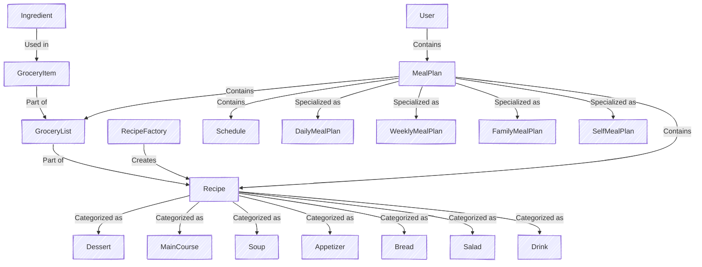
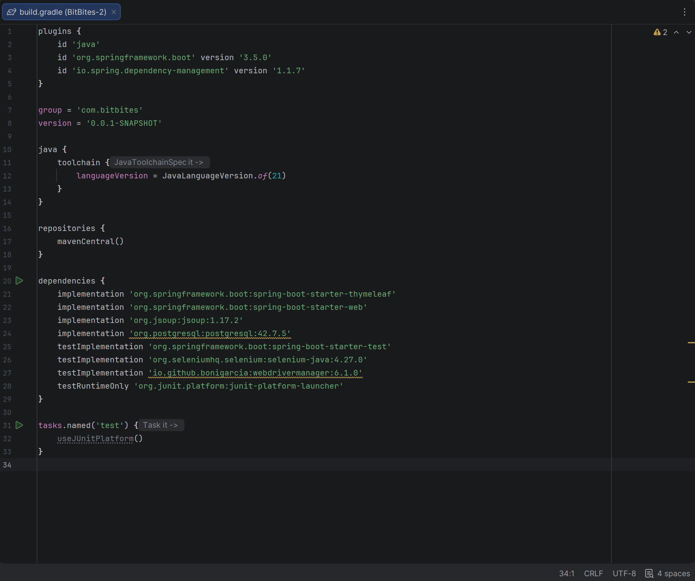
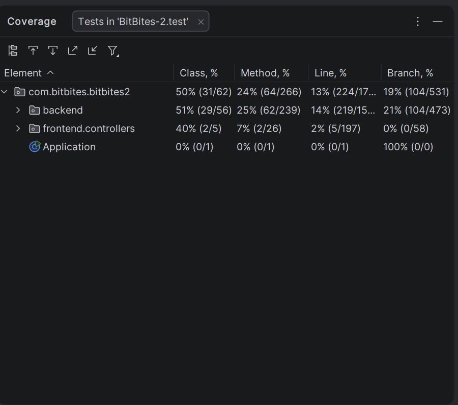
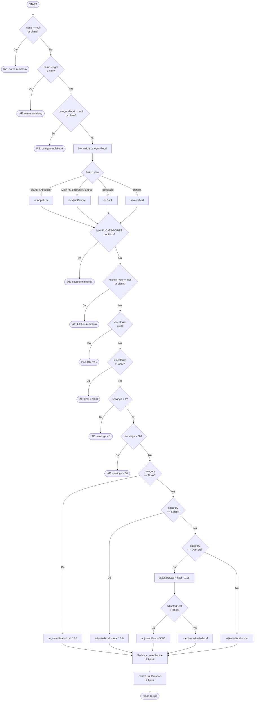

# Tema 3: Unitary Testing in Java - BitBites

**Team Members:**
* Alexandru Norina
* Balan Liviu
* Calinov Cosmin
* Fota Adrian
* Preda Cristian

---

# BitBites

## Overview

BitBites is a Java-based meal planning application that generates weekly meal plans and grocery lists based on selected recipes. The system is designed with an object-oriented approach, utilizing inheritance and factory patterns to efficiently manage meal planning.

## Videos and Presentation
App presentation video here: [https://s.go.ro/iv7t6hs7](https://s.go.ro/iv7t6hs7)

Execution of tests: [https://s.go.ro/iv7t6hs7](https://s.go.ro/01vsnz9c)

Powerpoint Presentation: [Java Unit Testing](presentation/Java%20Unit%20Testing.pptx)

## Features

- Define **ingredients** and categorize them.
- Create **recipes** with detailed attributes (calories, servings, instructions, etc.).
- Generate meal plans of different types (daily, weekly, family).
- Create a grocery list based on selected recipes.
- Create a grocery list based on an generated meal plan.
- Use a **factory pattern** to create recipes from a URL.
- Automatically **aggregate ingredients** and handle **unit conversions**.
- **Store meal plans** for users.
- Create **user database** with hashed store password.
- Ensure meal plans meet **caloric constraints**.
- (Bonus) Provide a **web interface** for managing recipes, meal plans, and grocery lists.

---

## Project Logic

The system follows a structured approach with interconnected components. The core logic revolves around:

- **Ingredients**: Represented by simple records, categorized for easier management.
- **Grocery Items**: Defined by their ingredient, quantity, and unit, allowing aggregation and unit conversion.
- **Recipes**: Abstract representation of a meal, categorized into different types like `Dessert`, `MainCourse`, etc.
- **Recipe Factory**: Initially supports importing recipes from a single website, with future extensibility for more sources.
- **Schedule**: Defines the structure of daily meals, ensuring a balanced meal plan.
- **Meal Plans**:
    - **SelfMealPlan**: The user provides a predefined list of recipes, and no generation logic is needed.
    - **Other Meal Plans (Daily, Weekly, Family)**:
        - The user selects kitchen types and a preparation time range.
        - The system randomly picks recipes from the chosen kitchen types while ensuring the total calorie intake is balanced.
        - The **FamilyMealPlan** extends the Weekly plan by adjusting portions based on the number of people.
        - The system prevents duplicate meals and balances meal distribution throughout the week.

### Diagram Representation

The following diagram visually represents the core logic of **BitBites**:



---
## Database

- implemented using ProsgreSQL 
- needed to add some Model classes in order to make the database
  - collections and arrays from the objects are transform in foreign keys in included classes
  - added records to store the id keys and the foreign keys
- added CRUD operations on all table (different functions for tables)

### Diagram

---

## Web Interface

The BitBites web application will provide the following functionalities:

- **Create and store recipes**.
- **Generate meal plans** of any type.
- **View the grocery list** for selected meal plans.
- **See the planned meals** for the week in a calendar format.

---

# Testing & Quality Assurance (QA) Documentation

This section details the software testing lifecycle for the BitBites application, including environment configuration, backend unit testing strategies, frontend UI automation, framework comparisons, and the use of AI tools during the testing phase.

## 1. Test Environment Configuration

### Hardware & Software Specifications
* **Operating System:** Windows 11 (64-bit)
* **Execution Environment:** Local Machine (No VM used)
* **Java Development Kit:** JDK 21.0.6
* **Test Database:** Local PostgreSQL (Default port 5432)

### Tools and Versions
* **Backend Framework:** JUnit 5 (Jupiter API)
* **Frontend Automation:** Selenium WebDriver (v4.31.0)
* **Web Browser Driver:** Firefox GeckoDriver (v0.36.0) running in `--headless` mode
* **Code Coverage Tool:** IntelliJ IDEA Built-in Coverage Runner
* **Build Tool:** Gradle




---
## 2. Testing Overview & Execution Summary

### 2.1. Traceability Matrix
This matrix correlates the implemented test suites with the functional modules of the application, highlighting the testing techniques applied to each component.

| Test Class | Target Component (Production) | Applied Testing Techniques | Status |
| :--- | :--- | :--- | :--- |
| **ApplicationTests** | Spring Boot Context | Smoke/Context Load (`@SpringBootTest`) | ✅ Passed |
| **GroceryListTest** | `GroceryList` | EP, BVA, Category Partitioning, Statement Coverage | ✅ Passed |
| **MealPlanFactoryTest** | `MealPlanFactory` | EP, BVA, Statement Coverage, Decision Coverage | ✅ Passed |
| **PasswordUtilsTest** | `PasswordUtils` | EP, BVA, Category Partitioning, Statement Coverage | ✅ Passed |
| **BoundaryValueTest** | `RecipeFactory` | Boundary Value Analysis (BVA) | ✅ Passed |
| **ConditionPathTest** | `RecipeFactory` | MC/DC, Independent Paths Coverage | ✅ Passed |
| **CoverageTest** | `RecipeFactory` | Statement Coverage, Decision Coverage | ✅ Passed |
| **EquivalencePartitioningTest** | `RecipeFactory` | Equivalence Partitioning (EP) | ✅ Passed |
| **MutationTest** | `RecipeFactory` | Mutation Testing (Killer Tests) | ✅ Passed |
| **RecipeTest** | `Recipe` | EP, BVA, Category Partitioning, Statement Coverage | ✅ Passed |
| **UnitConverterTest** | `UnitConverter` | EP, BVA, Category Partitioning, Statement Coverage | ✅ Passed |
| **SeleniumUITests** | Frontend UI (Web Routes) | UI Automation, End-to-End (E2E), Wait Strategies | ✅ Passed |

**Techniques Legend:**
* **EP:** Equivalence Partitioning
* **BVA:** Boundary Value Analysis
* **MC/DC:** Modified Condition/Decision Coverage
* **E2E:** End-to-End Testing
### 2.2. Test Suite Architecture

To ensure modular and maintainable testing, the test classes are logically grouped to target specific architectural components:

*   **Grocery Logic Tests (`GroceryListTest`, `UnitConverterTest`):** Validate aggregation, unit conversion, and sorting (`sortedGroceryList()`), with replacement behavior in `GroceryList` for incompatible units and strict `IllegalArgumentException` handling in `UnitConverter` when units are incompatible.
*   **Meal Plan Tests (`MealPlanFactoryTest`):** Ensure the correct instantiation of polymorphic meal plans (Daily, Weekly, Family, Self) using the Factory pattern, validating input parameters such as member counts.
*   **Security Tests (`PasswordUtilsTest`):** Verify the deterministic behavior and edge-case resilience of the SHA-256 password hashing utility.
*   **Recipe Factory Tests (Core Logic):** A comprehensive suite (`BoundaryValueTest`, `ConditionPathTest`, `CoverageTest`, `EquivalencePartitioningTest`, `MutationTest`) targeting `RecipeFactory`. It validates string constraints, caloric caps, category-specific modifiers (e.g., adjusting kilocalories by *0.8 for Drinks), and alias mappings using MC/DC and mutation testing.
*   **Recipe Domain Tests (`RecipeTest`):** Validate the abstract `Recipe` class, specifically the conversion of time strings into `Duration` objects and formatting outputs.
*   **E2E UI Tests (`SeleniumUITests`):** Execute automated, headless browser tests using Selenium WebDriver to validate frontend routing, form element presence, and authentication error handling.
*   **Smoke/Context Tests (`ApplicationTests`):** Validate that the Spring Boot application context loads successfully.

### 2.3. Test Execution & Coverage Report

The test suite was executed locally under the configured test environment. The execution yielded the following concrete metrics:

**Execution Summary:**
*   **Total Tests Executed:** 186
*   **Tests Passed:** 186
*   **Tests Failed:** 0
*   **Execution Status:** ✅ SUCCESS

**Coverage Analysis:**
The coverage metrics were extracted using the IntelliJ IDEA Built-in Coverage Runner. 
*   **Domain Logic Coverage:** The testing strategy aggressively targeted the core business rules (`backend.groceries`, `backend.mealplans`, `backend.recipes`, `PasswordUtils`).
*   **Overall Backend Class Coverage:** 50%.
*   **Overall Frontend Controller Class Coverage:** 40%.
*   **Out of Scope Justification:** The overall line and branch coverage percentages logically reflect the deliberate exclusion of the Data Access Layer (`Repositories`) and database integration modules (`Services`) from the current unit testing phase. These structural components are explicitly out of scope for isolated unit tests and are reserved for future integration testing phases.
---
## 3. Black-Box Testing (Specification-Based)

To validate the application's core business logic without relying on its internal structure, we applied Black-Box techniques across all major components. The test classes are grouped by the specific technique applied:

### 3.1. Equivalence Class Partitioning (EP)
Input data was categorized into valid and invalid partitions to ensure full scenario coverage while minimizing redundant test cases.

*   **`GroceryListTest`:** Partitioned inputs to validate adding new ingredients, merging existing ingredients with compatible units, and replacing existing ingredients with incompatible units.
*   **`MealPlanFactoryTest`:** Partitioned input strings for generating specific meal plans (`"daily"`, `"family"`, `"self"`, `"weekly"`) and handled invalid unknown types.
*   **`PasswordUtilsTest`:** Grouped inputs into empty passwords, standard alphanumeric passwords, and special/Unicode characters to ensure deterministic SHA-256 hashing.
*   **`EquivalencePartitioningTest` (`RecipeFactory`):** Validated string lengths for recipe names, allowed kitchen types, and enforced numerical domains for kilocalories (0, 5000] and servings [1, 50].
*   **`RecipeTest`:** Partitioned time unit inputs into valid strings (`"h"`, `"minutes"`, `"s"`) and invalid strings (`"days"`).
*   **`UnitConverterTest`:** Grouped conversions into identity (same unit), intra-category (e.g., mass-to-mass), inter-category compatibility, and strict incompatibility.

### 3.2. Boundary Value Analysis (BVA)
Tests were implemented at the absolute edges of the defined equivalence partitions to prevent off-by-one errors and handle extreme constraints.

*   **`GroceryListTest`:** Tested the transition from an empty list to containing the first element, and handled exact quantities resulting from fractional conversions.
*   **`MealPlanFactoryTest`:** Validated the lower boundary for the number of members in a `FamilyMealPlan` (minimum 1) and tested empty string inputs.
*   **`PasswordUtilsTest`:** Validated hashing stability at extreme boundaries: minimum non-empty length (1 character) and massive inputs (1000 characters).
*   **`BoundaryValueTest` (`RecipeFactory`):** Tested absolute string length limits (0, 1, 100, 101 characters), numerical thresholds for calories (`0.001`, `5000.0`, `5000.001`), and serving limits (0, 1, 50, 51).
*   **`RecipeTest`:** Tested duration assignments with boundary quantities (`0`).
*   **`UnitConverterTest`:** Validated precision boundaries using micro-fractions (`0.000001`) and large thresholds (`1,000,000`) to check for floating-point accuracy and integer overflows. Negative quantities are not rejected by the current implementation, so no exception is expected for negative values.


### 3.3. Category Partitioning
Used to evaluate functionalities that depend on multiple independent parameters interacting together.
*   Applied across **`GroceryListTest`** (combining empty/non-empty lists with common/distinct ingredients) and **`UnitConverterTest`** (combining volume-to-kitchen and kitchen-to-mass parameter interactions).



---

## 4. White-Box Testing (Structure-Based)

White-Box testing was conducted to analyze the internal architecture, ensuring comprehensive execution of all code paths, branches, and logical decisions.

### 4.1. Statement and Decision Coverage
We utilized the IntelliJ IDEA Coverage Runner to guarantee that every line of code and every boolean branch was executed.

*   **`CoverageTest` (`RecipeFactory`):** Enforced execution of all 16 statements (SC1-SC16), including error-handling branches and caloric adjustments. Evaluated 14 logical decisions (DC1-DC14) as both `true` and `false`.
*   **`GroceryListTest`:** Covered all branches in the `addItem` and `addLists` methods, traversing the conditional logic for item merging and exception catching.
*   **`MealPlanFactoryTest`:** Ensured all `switch` cases and the `default` fallback were executed and evaluated.
*   **`PasswordUtilsTest`:** Executed the try path for SHA-256 hashing; the catch branch is documented but not expected to trigger on a standard JVM.
*   **`RecipeTest` & `UnitConverterTest`:** Achieved coverage on complex nested `switch` statements, validating both matching cases and default exception throws.

### 4.2. Modified Condition/Decision Coverage (MC/DC)
Applied to complex decision structures utilizing logical operators to ensure atomic conditions independently affect the outcome.
*   **`ConditionPathTest` (`RecipeFactory`):** Validated compound conditions such as `name == null || name.trim().isEmpty()` by testing short-circuit evaluation (C1a), full string evaluation (C1b), and the valid false branch (C1c).


#### Flowchart - RecipeFactory (Independent Paths)
The following diagram illustrates the decision points in the recipe creation method, outlining the independent paths:
To ensure structural robustness, our testing efforts heavily focused on the `RecipeFactory` due to its critical role in data validation, alias mapping, and category-specific business logic. The following diagram visually illustrates the complex decision points in the recipe creation method, outlining the independent paths that our test suite covers:

### 4.3. Cyclomatic Complexity and Independent Paths
The cyclomatic complexity ($V(G) = E - N + 2$) was calculated for critical methods to mathematically determine the required number of independent test paths.

*   **`UnitConverter.convert()`:** $V(G) = 33$. Tests traverse independent paths within nested `switch` structures.
*   **`GroceryListTest` (`addItem`):** $V(G) = 3$. Independent paths mapped to: item not in list, item exists + successful conversion, item exists + failed conversion.
*   **`MealPlanFactoryTest` (`createMealPlan`):** $V(G) = 5$. Covered paths for all 4 plan types and the invalid fallback.
*   **`PasswordUtilsTest` & `RecipeTest`:** Calculated and mapped paths for algorithmic loops and switch structures.
*   **`ConditionPathTest` (`RecipeFactory.createCustomRecipe()`):** Identified $V(G) = 31$ decision points resulting in 23 implemented independent tests (IP1-IP23), traversing all error states, alias mappings, and caloric modifiers.


---

## 5. Mutation Testing

To prove the rigor and fault-detection capability of our test suite, we injected artificial defects (mutants) into the source code. All non-equivalent mutants were successfully eliminated by dedicated "Killer Tests" in the `MutationTest` class.

*   **Arithmetic Mutants:** Altered caloric multipliers (e.g., for the `Drink` category, the `kilocalories * 0.8` formula was mutated to `* 0.9`). The tests failed, validating the precision of our assertions (e.g., `mt6_killMutant_drinkKcalMultiplierIs08`).
*   **Relational Mutants:** Modified comparison operators at boundary values (e.g., changing the hard-cap threshold from `> 5000` to `>= 5000`). The test suite immediately detected the mutation (`mt9_killMutant_dessertCapBoundaryIsStrictlyGreater`), proving that assertions strictly cover the established intervals.
*   **Statement Deletion Mutants:** Tested the removal of the `.trim()` method call on string inputs. The defect was efficiently caught by `mt11_killMutant_nameTrimIsApplied`.

The cyclomatic complexity ($V(G) = E - N + 2$) was then calculated for this and other critical methods to mathematically determine the required number of independent test paths based on their internal structures.

*   **`ConditionPathTest` (`RecipeFactory.createCustomRecipe()`):** Identified $V(G) = 31$ decision points resulting in 23 implemented independent tests (IP1-IP23), thoroughly traversing all error states, alias mappings, and caloric modifiers shown in the flowchart above.
*   **`UnitConverter.convert()`:** $V(G) = 33$. Tests traverse independent paths within nested `switch` structures.
*   **`GroceryListTest` (`addItem`):** $V(G) = 3$. Independent paths mapped to: item not in list, item exists + successful conversion, item exists + failed conversion.
*   **`MealPlanFactoryTest` (`createMealPlan`):** $V(G) = 5$. Covered paths for all 4 plan types and the invalid fallback.
*   **`PasswordUtilsTest` & `RecipeTest`:** Calculated and mapped paths for algorithmic loops and switch structures.

---

## 6. Recipe Factory Tests - Deep Dive Analysis

The `RecipeFactory.createCustomRecipe()` method is the critical component of the application's recipe validation and creation logic. Due to its complexity ($V(G) = 31$), multiple parameter constraints, and category-specific business rules, it is tested using **five complementary test classes**, each targeting a different dimension of the method's behavior. This multi-layered approach ensures comprehensive defect detection.

### 6.1. Why Five Test Classes for One Method?

The five `RecipeFactory` test classes address different testing objectives that are **not redundant**, but rather **complementary**:

| Test Class | Primary Objective | Techniques Applied | Key Defects Caught |
|:---|:---|:---|:---|
| **EquivalencePartitioningTest** | Input domain partitioning | EP (18 partitions) | Invalid inputs, constraint violations |
| **BoundaryValueTest** | Edge-case detection | BVA (14 boundaries) | Off-by-one errors, floating-point precision issues |
| **ConditionPathTest** | Logical decision coverage | MC/DC (23 paths) | Logic errors in compound conditions |
| **CoverageTest** | All code paths executed | Statement + Decision Coverage (16 paths) | Unreachable/dead code, skipped branches |
| **MutationTest** | Test quality verification | Mutation Killing (12 mutants) | Insufficient assertions, weak test logic |

**Example Scenario:** A boundary value of `kilocalories = 5000.0` might pass EP testing (valid partition), but only BVA catches that `5000.001` must fail. Mutation testing then confirms that the condition is strictly `>` (not `>=`).

---

### 6.2. EquivalencePartitioningTest - Complete Partition Mapping

**Objective:** Validate that all distinct input classes are handled correctly, minimizing redundant tests while ensuring full coverage.

**Partition Structure (18 Equivalence Classes):**

```
name parameter (5 partitions):
  ├─ EP1:  null                              → IllegalArgumentException
  ├─ EP2:  "" or "   " (blank/whitespace)   → IllegalArgumentException
  ├─ EP3:  "A" to "ValidName" (1-100 chars) → Valid recipe created
  └─ EP4:  "A"*101 (> 100 chars)             → IllegalArgumentException

categoryFood parameter (5 partitions):
  ├─ EP5:  null                              → IllegalArgumentException
  ├─ EP6:  "" or "   " (blank)               → IllegalArgumentException
  ├─ EP7:  Valid category ("Soup", "Dessert", etc.)
                                              → Valid recipe created
  ├─ EP8:  Valid alias ("Starter" → "Appetizer", "Entree" → "MainCourse")
                                              → Valid recipe created
  └─ EP9:  Invalid category ("Pizza", "Pasta")
                                              → IllegalArgumentException

kitchenType parameter (3 partitions):
  ├─ EP10: null                              → IllegalArgumentException
  ├─ EP11: "" or "   " (blank)               → IllegalArgumentException
  └─ EP12: Valid kitchen type ("Italian", "Asian", etc.)
                                              → Valid recipe created

kilocalories parameter (3 partitions):
  ├─ EP13: ≤ 0 (zero or negative)            → IllegalArgumentException
  ├─ EP14: (0, 5000] (valid range)           → Valid recipe created
  └─ EP15: > 5000                            → IllegalArgumentException

servings parameter (3 partitions):
  ├─ EP16: < 1 (zero or negative)            → IllegalArgumentException
  ├─ EP17: [1, 50] (valid range)             → Valid recipe created
  └─ EP18: > 50                              → IllegalArgumentException
```

**Test Case Mapping:**
- `ep1_nameNull_throwsException()` → EP1
- `ep2_nameBlank_throwsException()` → EP2
- `ep3_nameValid_recipeCreated()` → EP3
- `ep4_nameTooLong_throwsException()` → EP4
- (... and 14 more test methods covering EP5-EP18)

**Real-World Relevance:** A recipe name exceeding 100 characters would overflow UI display fields or database column limits. Empty categories prevent proper meal plan generation logic. Out-of-range kilocalories break caloric balance algorithms.

---

### 6.3. BoundaryValueTest - Precise Edge-Case Testing

**Objective:** Test the exact boundary thresholds where behavior changes. Boundary Value Analysis reveals off-by-one errors and floating-point precision bugs invisible to equivalence partitioning.

**Boundary Values (14 Test Cases):**

```
name length (domeniu [1, 100]):
  BV1:  length = 0        → should throw (boundary -1)
  BV2:  length = 1        → should pass (boundary +1)
  BV3:  length = 100      → should pass (boundary)
  BV4:  length = 101      → should throw (boundary +1)

kilocalories (domeniu (0, 5000]):
  BV5:  0.0               → should throw (boundary)
  BV6:  0.001             → should pass (just inside boundary)
  BV7:  5000.0            → should pass (boundary)
  BV8:  5000.001          → should throw (just outside boundary)

servings (domeniu [1, 50]):
  BV9:  0                 → should throw (just outside boundary)
  BV10: 1                 → should pass (boundary)
  BV11: 50                → should pass (boundary)
  BV12: 51                → should throw (just outside boundary)

Dessert category special case (internal cap at kcal * 1.15 > 5000):
  BV13: kilocalories = 4347  → adjustedKcal = 4999.05 (< 5000) → no cap applied
  BV14: kilocalories = 4348  → adjustedKcal = 5000.2 (> 5000)  → cap at 5000
```

**Why This Matters:**
- **BV1 vs BV2:** Ensures 0-length names are rejected while 1-length names are accepted, and confirms the maximum boundary allows 100 characters but rejects 101 (condition should be `> 100`, not `>= 100`).
- **BV5 vs BV6:** Catches mutations like `kilocalories <= 0` (allows 0) vs `kilocalories < 0` (allows 0).
- **BV13 vs BV14:** Validates the dessert cap logic is applied only when strictly exceeded, not at equality.

**Floating-Point Precision:** BV6 (`0.001`) tests that the check is `<= 0` (not `< 0`), catching cases where kilocalories are extremely small but valid. This prevents rounding errors in formula calculations.

---

### 6.4. ConditionPathTest - Modified Condition/Decision Coverage (MC/DC)

**Objective:** Ensure each condition in a compound decision independently affects the outcome. This catches logic errors like missing parentheses or incorrect `&&`/`||` operators.

**MC/DC Analysis (Compound Conditions):**

```
Compound Condition C1: (name == null) || (name.trim().isEmpty())
  
  MC/DC Sub-paths:
    C1a: name == null → true
         Decision outcome: true (short-circuit, second condition not evaluated)
         Test: mcdcC1a_nameNull_conditionTrue()
  
    C1b: name != null AND name.trim().isEmpty() → true  
         Decision outcome: true (first condition false, second true)
         Test: mcdcC1b_nameBlank_secondConditionTrue()
  
    C1c: name != null AND name.trim().isEmpty() → false
         Decision outcome: false (both conditions false)
         Test: mcdcC1c_nameValid_conditionFalse()

Compound Condition C2: (categoryFood == null) || (categoryFood.trim().isEmpty())
  Similar 3-path analysis for validation

Compound Condition C3: (kitchenType == null) || (kitchenType.trim().isEmpty())
  Similar 3-path analysis for validation
```

**Why It Matters - Real Mutation Example:**
```java
// Original code (CORRECT):
if (name == null || name.trim().isEmpty()) {
    throw new IllegalArgumentException("Name cannot be null or empty");
}

// Incorrect mutation (CAUGHT by MC/DC):
if (name == null && name.trim().isEmpty()) {  // Changed || to &&
    throw new IllegalArgumentException("Name cannot be null or empty");
}
// With this mutation: name="" passes validation (BUG!)
// MC/DC test mcdcC1b detects this: name="   " should throw, but doesn't.
```

**Total Independent Paths:** 23 paths (IP1-IP23) traverse all validation states, alias mappings, and category-specific kilocalorie adjustments.

---

### 6.5. CoverageTest - Statement and Decision Coverage

**Objective:** Execute every line of code and every branch decision, ensuring no dead code paths exist.

**Coverage Structure (16 Statement Paths + 14 Decision Points):**

```
SC1-SC9:   Input validation checks (all 9 IAE conditions)
SC10-SC12: Category alias mapping (Starter→Appetizer, Entree→MainCourse, Beverage→Drink)
SC13-SC15: Kilocalorie adjustment by category:
           - SC13: Drink category   → adjustedKcal = kcal * 0.8
           - SC14: Salad category   → adjustedKcal = kcal * 0.9
           - SC15: Dessert category → adjustedKcal = kcal * 1.15
SC16:      Dessert cap application (if adjustedKcal > 5000 → cap at 5000)

Decision Coverage (DC1-DC14):
  DC1-DC9:   All validation conditions evaluated as both true and false
  DC10-DC12: All alias cases covered (if Starter, if Entree, if Beverage, default)
  DC13:      Dessert cap decision (if adjustedKcal > 5000, else not)
  DC14:      Recipe type selection (7 recipe subtypes based on category)
```

**Test Examples:**
```java
// SC1: Name validation - happy path (passes validation)
Recipe r1 = RecipeFactory.createCustomRecipe("Pasta", "MainCourse", "Italian", 500, 4);

// SC10 + DC10: Alias mapping - "Starter" → "Appetizer"
Recipe r2 = RecipeFactory.createCustomRecipe("Bruschetta", "Starter", "Italian", 150, 6);

// SC15 + DC13: Dessert with cap
Recipe r3 = RecipeFactory.createCustomRecipe("Cake", "Dessert", "French", 4348, 8);
// Expected: adjustedKcal = 5000 (capped from 4348 * 1.15 = 5000.2)
```

---

### 6.6. MutationTest - Fault-Detection Capability Verification

**Objective:** Inject artificial defects (mutants) into code and verify that tests catch them. This validates test suite quality.

**12 Killer Tests (M1-M12):**

```
BOUNDARY CONDITION MUTATIONS:

M1: kilocalories <= 0  →  kilocalories < 0
    Mutation effect: kilocalories = 0.0 would pass (BUG)
    Killer test: mt1_killMutant_kcalZeroMustThrow()
    Assertion: assertThrows(IllegalArgumentException.class, 
                           () → createCustomRecipe(..., 0.0, ...))

M2: kilocalories > 5000  →  kilocalories >= 5000
    Mutation effect: kilocalories = 5000 would throw error (BUG)
    Killer test: mt2_killMutant_kcal5000MustBeValid()
    Assertion: assertEquals(5000.0, recipe.getKilocalories())

M3: servings < 1  →  servings <= 1
    Mutation effect: servings = 1 would throw error (BUG)
    Killer test: mt3_killMutant_servings1MustBeValid()

M4: servings > 50  →  servings >= 50
    Mutation effect: servings = 50 would throw error (BUG)
    Killer test: mt4_killMutant_servings50MustBeValid()

M5: name.length() > 100  →  name.length() >= 100
    Mutation effect: name of 100 chars would throw error (BUG)
    Killer test: mt5_killMutant_name100CharsMustBeValid()

────────────────────────────────────────────────────────────────

ARITHMETIC MUTANTS (Category Multipliers):

M6: kilocalories * 0.8  →  kilocalories * 0.9  (Drink category)
    Mutation effect: Drink kcal would be miscalculated
    Killer test: mt6_killMutant_drinkKcalMultiplierIs08()
    Test data: kcal = 1000, category = "Drink"
    Expected: recipe.getKilocalories() == 800 (not 900)
    Assertion detects: assertNotEquals(900, actual)

M7: kilocalories * 0.9  →  kilocalories * 0.8  (Salad category)
    Killer test: mt7_killMutant_saladKcalMultiplierIs09()
    Test data: kcal = 1000, category = "Salad"
    Expected: recipe.getKilocalories() == 900 (not 800)

M8: kilocalories * 1.15  →  kilocalories * 1.0  (Dessert category)
    Killer test: mt8_killMutant_dessertKcalMultiplierIs115()
    Test data: kcal = 1000, category = "Dessert"
    Expected: recipe.getKilocalories() == 1150 (not 1000)

────────────────────────────────────────────────────────────────

LOGIC MUTATIONS:

M9: adjustedKcal > 5000  →  adjustedKcal >= 5000  (Dessert cap)
    Mutation effect: Cap applied when kcal*1.15 == exactly 5000 (off-by-one)
    Killer test: mt9_killMutant_dessertCapBoundaryIsStrictlyGreater()
    Test data: kcal = 4347 (adjustedKcal = 4999.05, should NOT be capped)
    Expected: recipe.getKilocalories() == 4999.05 (not 5000)

M10: Alias "Starter" → "Appetizer" removed
    Mutation effect: "Starter" input would throw exception instead of mapping
    Killer test: mt10_killMutant_starterAliasMapping()
    Test: recipe = createCustomRecipe("Bruschetta", "Starter", ...)
    Expected: recipe category is "Appetizer", no exception

────────────────────────────────────────────────────────────────

STATEMENT DELETION MUTATIONS:

M11: name.trim() call removed
    Mutation effect: "  Pasta  " would be stored as "  Pasta  " (with spaces)
    Killer test: mt11_killMutant_nameTrimIsApplied()
    Test data: name = "  Pasta  "
    Expected: recipe.getName() == "Pasta" (spaces trimmed)
    Assertion: assertEquals("Pasta", recipe.getName())

M12: Alias "Entree" → "MainCourse" removed
    Killer test: mt12_killMutant_entreeAliasMapping()
```

**Mutation Testing Insight:**
All 12 non-equivalent mutants were successfully killed, proving that the test suite:
- ✅ Detects boundary violations
- ✅ Validates arithmetic precision
- ✅ Catches logic errors
- ✅ Verifies data transformations (trim, alias mapping)

If any killer test failed, it would indicate a weak assertion or missing edge-case test.

---

### 6.7. Testing Methodology Complementarity

**Why all five tests together ensure robustness:**

```
Input: kilocalories = 5000.0, category = "Dessert"

Test Layer 1 - EquivalencePartitioningTest:
  └─ Asks: "Is 5000 in the valid partition (0, 5000]?"
     Answer: YES (5000 is at the boundary but still valid)
     ✓ Passes EP14 (valid partition)

Test Layer 2 - BoundaryValueTest:
  └─ Asks: "Is 5000 exactly at or beyond the boundary?"
     Answer: YES (BV7 - exactly at boundary, should pass)
     ✓ Passes BV7_kilocalories5000_recipeCreated()

Test Layer 3 - CoverageTest:
  └─ Asks: "Do all code branches execute for this input?"
     Answer: YES (executes SC15 for Dessert, SC16 for cap check)
     ✓ Passes SC15, SC16 statements

Test Layer 4 - ConditionPathTest:
  └─ Asks: "Do compound conditions evaluate correctly?"
     Answer: YES (all validation conditions false, category matched)
     ✓ Passes IP14 (Dessert success path)

Test Layer 5 - MutationTest:
  └─ Asks: "Would weak assertions miss defects?"
     Answer: NO (M9 mutation would fail because we check:
             assertEquals(5000.0, actual, DELTA))
     ✓ Kills M9 mutant (catches `>= 5000` instead of `> 5000`)

Final Result: kilocalories = 5000.0 is THOROUGHLY validated
```

---

### 6.8. Recommended Test Execution Order

1. **EquivalencePartitioningTest** (baseline coverage)
2. **BoundaryValueTest** (catch edge cases)
3. **CoverageTest** (verify all paths execute)
4. **ConditionPathTest** (validate logic decisions)
5. **MutationTest** (verify test quality)

**Expected Results:** All 186 tests pass ✅

---

## 7. UI Automation Testing (Frontend)

End-to-End (E2E) testing of the graphical user interface was performed using **Selenium WebDriver** (`SeleniumUITests.java`). To optimize execution and reduce flakiness caused by network latency, tests were executed using the Firefox browser in `--headless` mode with `PageLoadStrategy.NONE`.

**Validated Scenarios (10 Automated UI Tests):**
1.  **Page Load Verification:** Confirmed that the DOM correctly renders the `<h2>` and `<h3>` headers for the `/user/login`, `/user/register`, and `/recipe/` routes.
2.  **Form Element Presence:** Ensured authentication forms contain the correct HTML `required` attributes and that password fields are securely masked (`type="password"`).
3.  **Routing and Navigation:** Validated internal links by simulating clicks on the Navbar (Brand Logo, Login, Register) to ensure correct endpoint redirection without dead links.
4.  **Error Handling:** Simulated login attempts with invalid credentials to verify the dynamic rendering of the `.alert-danger` UI component.

---

### 8. References & Bibliography
[1] R. S. Pressman, Software Engineering: A Practitioner's Approach (8th ed.), McGraw-Hill Education, 2014.
[2] JUnit Team, JUnit 5 User Guide, https://junit.org/junit5/docs/current/user-guide/, Last accessed: May 3, 2026.
[3] Selenium Team, Selenium WebDriver Documentation, https://www.selenium.dev/documentation/webdriver/, Last accessed: May 3, 2026.
[4] GitHub Copilot, https://copilot.microsoft.com, Generated: May 3, 2026.
[5] Google Gemini, https://gemini.google.com/app, Generated: May 3, 2026.
---

## License

MIT License.
