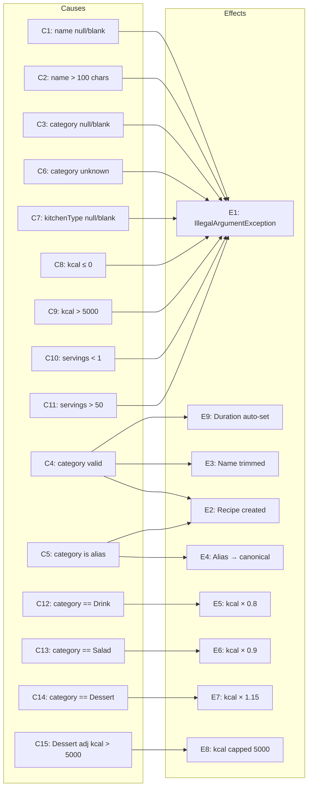

# Cause-Effect Graph for `createCustomRecipe`

## Causes (Inputs / Conditions)

| ID  | Cause                              |
|-----|------------------------------------|
| C1  | name is null or blank              |
| C2  | name length > 100                  |
| C3  | categoryFood is null or blank      |
| C4  | categoryFood is a valid category   |
| C5  | categoryFood is a known alias      |
| C6  | categoryFood is unknown/invalid    |
| C7  | kitchenType is null or blank       |
| C8  | kilocalories ≤ 0                   |
| C9  | kilocalories > 5000                |
| C10 | servings < 1                       |
| C11 | servings > 50                      |
| C12 | category == "Drink"                |
| C13 | category == "Salad"                |
| C14 | category == "Dessert"              |
| C15 | Dessert adjusted kcal > 5000       |

## Effects (Outputs / Outcomes)

| ID  | Effect                                      |
|-----|---------------------------------------------|
| E1  | IllegalArgumentException thrown              |
| E2  | Recipe created (correct subclass)            |
| E3  | Name is trimmed                              |
| E4  | Alias mapped to canonical category           |
| E5  | kcal adjusted × 0.8 (Drink)                 |
| E6  | kcal adjusted × 0.9 (Salad)                 |
| E7  | kcal adjusted × 1.15 (Dessert)              |
| E8  | kcal capped at 5000                          |
| E9  | Default duration set based on category       |

## Cause-Effect Graph (Mermaid)

## Decision Table

| Rule | C1 | C2 | C3 | C6 | C7 | C8 | C9 | C10 | C11 | C4 | C5 | C12 | C13 | C14 | C15 | → E1 | → E2 | → E3 | → E4 | → E5 | → E6 | → E7 | → E8 | → E9 |
|------|----|----|----|----|----|----|----|----|-----|----|----|-----|-----|-----|-----|------|------|------|------|------|------|------|------|------|
| R1   | T  | -  | -  | -  | -  | -  | -  | -  | -   | -  | -  | -   | -   | -   | -   | ✓    |      |      |      |      |      |      |      |      |
| R2   | F  | T  | -  | -  | -  | -  | -  | -  | -   | -  | -  | -   | -   | -   | -   | ✓    |      |      |      |      |      |      |      |      |
| R3   | F  | F  | T  | -  | -  | -  | -  | -  | -   | -  | -  | -   | -   | -   | -   | ✓    |      |      |      |      |      |      |      |      |
| R4   | F  | F  | F  | T  | -  | -  | -  | -  | -   | -  | -  | -   | -   | -   | -   | ✓    |      |      |      |      |      |      |      |      |
| R5   | F  | F  | F  | F  | T  | -  | -  | -  | -   | -  | -  | -   | -   | -   | -   | ✓    |      |      |      |      |      |      |      |      |
| R6   | F  | F  | F  | F  | F  | T  | -  | -  | -   | -  | -  | -   | -   | -   | -   | ✓    |      |      |      |      |      |      |      |      |
| R7   | F  | F  | F  | F  | F  | F  | T  | -  | -   | -  | -  | -   | -   | -   | -   | ✓    |      |      |      |      |      |      |      |      |
| R8   | F  | F  | F  | F  | F  | F  | F  | T  | -   | -  | -  | -   | -   | -   | -   | ✓    |      |      |      |      |      |      |      |      |
| R9   | F  | F  | F  | F  | F  | F  | F  | F  | T   | -  | -  | -   | -   | -   | -   | ✓    |      |      |      |      |      |      |      |      |
| R10  | F  | F  | F  | F  | F  | F  | F  | F  | F   | T  | F  | T   | -   | -   | -   |      | ✓    | ✓    |      | ✓    |      |      |      | ✓    |
| R11  | F  | F  | F  | F  | F  | F  | F  | F  | F   | T  | F  | F   | T   | -   | -   |      | ✓    | ✓    |      |      | ✓    |      |      | ✓    |
| R12  | F  | F  | F  | F  | F  | F  | F  | F  | F   | T  | F  | F   | F   | T   | F   |      | ✓    | ✓    |      |      |      | ✓    |      | ✓    |
| R13  | F  | F  | F  | F  | F  | F  | F  | F  | F   | T  | F  | F   | F   | T   | T   |      | ✓    | ✓    |      |      |      | ✓    | ✓    | ✓    |
| R14  | F  | F  | F  | F  | F  | F  | F  | F  | F   | T  | F  | F   | F   | F   | -   |      | ✓    | ✓    |      |      |      |      |      | ✓    |
| R15  | F  | F  | F  | F  | F  | F  | F  | F  | F   | -  | T  | -   | -   | -   | -   |      | ✓    | ✓    | ✓    |      |      |      |      | ✓    |
