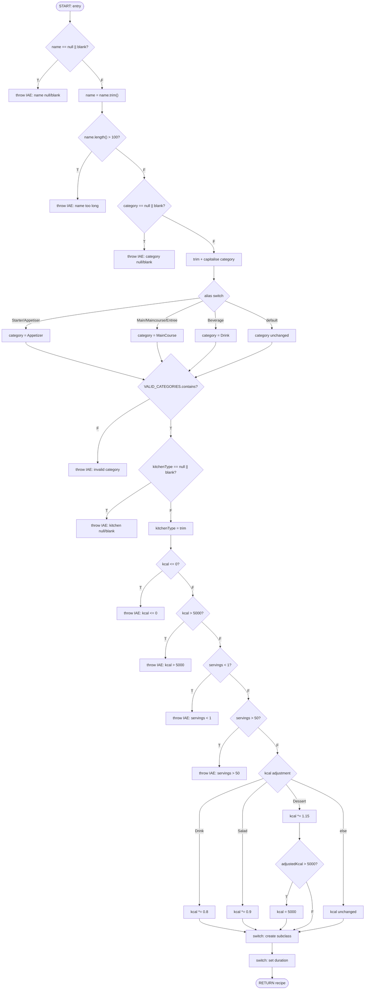

# Functional Graph for `createCustomRecipe`

## Control Flow Graph (CFG)

The nodes represent linear code blocks; edges represent jumps (branches, returns, throws).

## Node & Edge Count

| Metric | Value |
|--------|-------|
| Nodes (N) | 28 |
| Edges (E) | 33 |
| Connected components (P) | 1 |
| **Cyclomatic Complexity** V(G) = E − N + 2P | **33 − 28 + 2 = 7** |

> Note: The switch statements with 7+1 arms are counted as single decision nodes
> for the high-level CFG. Expanding each switch arm would give a higher V(G).

## LCSAJ Table

| # | Start Node | Linear Sequence | Jump To |
|---|-----------|-----------------|---------|
| 1 | START | N1(T) | T1 (throw) |
| 2 | START | N1(F)→N2→N3(T) | T2 (throw) |
| 3 | START | N1(F)→N2→N3(F)→N4(T) | T3 (throw) |
| 4 | START | …→N4(F)→N5→N6→A*→N7(F) | T4 (throw) |
| 5 | START | …→N7(T)→N8(T) | T5 (throw) |
| 6 | START | …→N8(F)→N9→N10(T) | T6 (throw) |
| 7 | START | …→N10(F)→N11(T) | T7 (throw) |
| 8 | START | …→N11(F)→N12(T) | T8 (throw) |
| 9 | START | …→N12(F)→N13(T) | T9 (throw) |
| 10 | START | …→N13(F)→N14→ADJ1→CREATE→DUR | RET |
| 11 | START | …→N13(F)→N14→ADJ2→CREATE→DUR | RET |
| 12 | START | …→N13(F)→N14→ADJ3→N15(F)→CREATE→DUR | RET |
| 13 | START | …→N13(F)→N14→ADJ3→N15(T)→CAP→CREATE→DUR | RET |
| 14 | START | …→N13(F)→N14→ADJ4→CREATE→DUR | RET |

## Expanded Creation/Duration Switch Paths

Each of the 7 valid categories goes through its own arm in both the creation
switch and the duration switch, yielding 7 distinct end-to-end happy paths
(× the 4 kcal-adjustment paths = 10 distinct LCSAJs since Drink/Salad/Dessert
have fixed category-kcal pairings).
